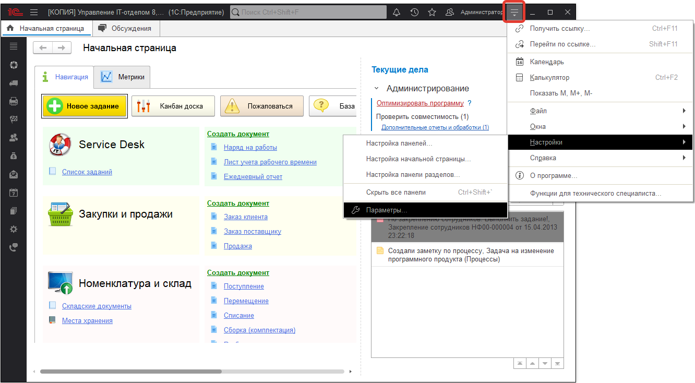
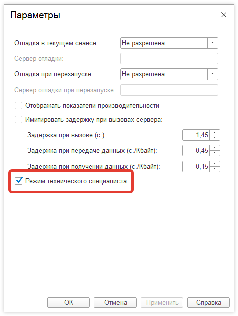
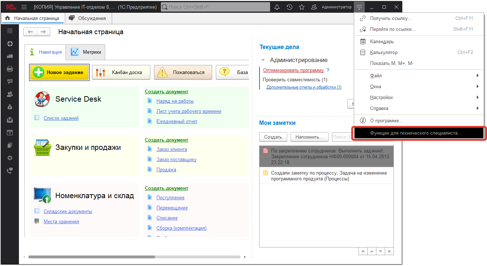

# Как открыть форму "Все функции"

Форму можно открыть следующим образом:

1. Сначала активируем видимость в меню (если она не видима)

Далее:

2. Теперь в меню видно пункт "Все функции". Открываем его:

Используя этот пункт можно изменить или открыть любой объект конфигурации
