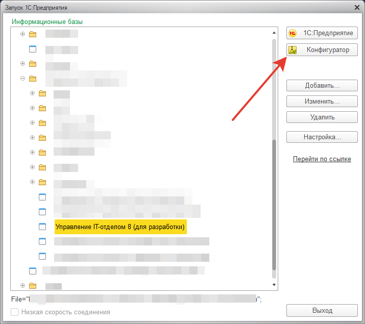
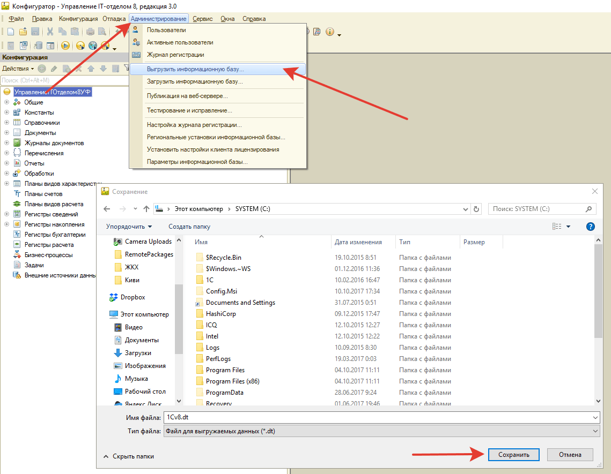
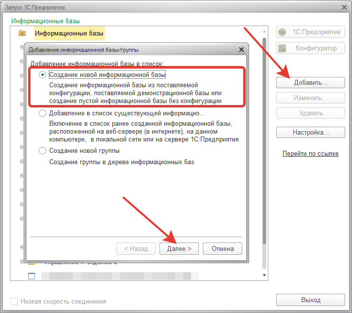
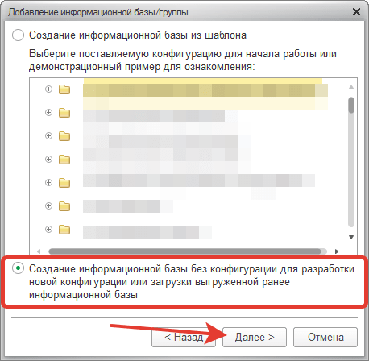
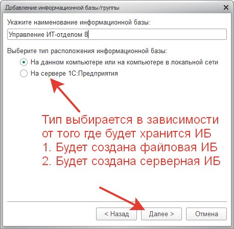
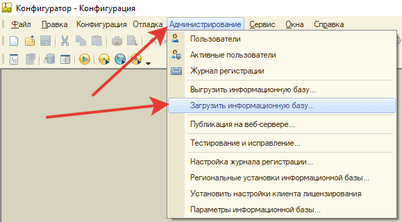

# Как перенести конфигурацию на другой компьютер/сервер?

Для переноса информационной базы необходимо иметь доступ к административной учетной записи в ИБ (информационной базе).
Далее, входим в конфигуратор

Введем данные администратора ИБ, после попадем в конфигуратор.
В конфигураторе совершим следующее и сохраним этот файл в нужную нам папку:

Итак, мы сохранили резервную копию ИБ.
Запоминаем путь, куда сохранили. После сохранения копируем этот файл на другой компьютер (если это необходимо), или сохраняем на флэшку и переносим на другой компьютер.

Разворачивание на другом компьютере:

Далее:

Третий шаг:

Подробнее об этом можете прочесть в интернете, чем отличается файловая база от серверной.
Для примера выберем базу файловую, файловая база может быть как на локальном компьютере, так и в сети в расшареной папке.

Будет создана в указанной папке пустая информационная база.
Снова открываем ее в конфигураторе.

