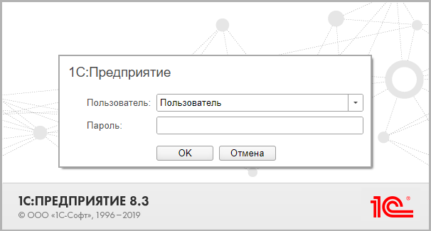
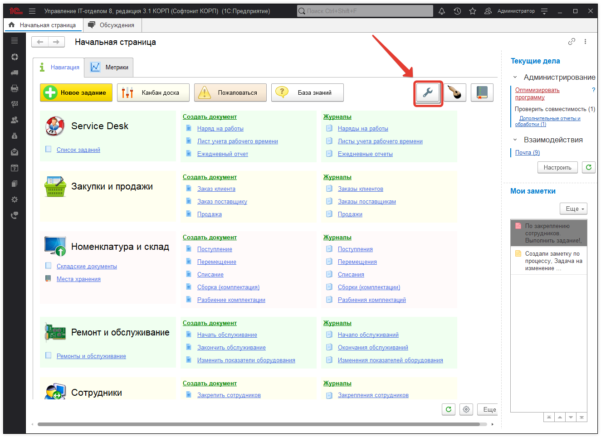
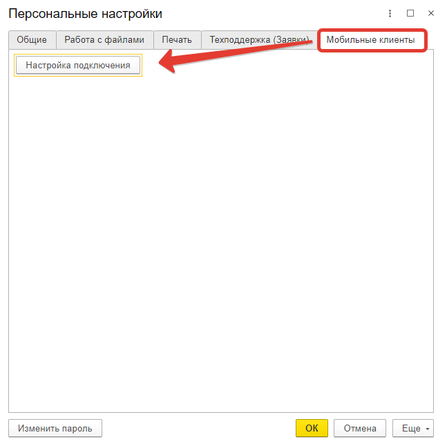
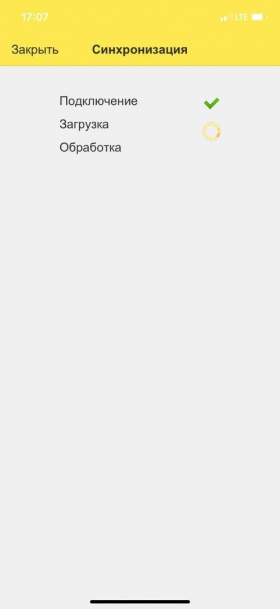

# Как подключить мобильное приложение к демо-базе?

## Шаг №1. 
Установите мобильное приложение из Google Play или AppStore

https://play.google.com/store/apps/details?id=ru.softonit.uitmobile&utm_source=softonit&utm_medium=organic&utm_campaign=site

https://apps.apple.com/us/app/управление-it-отделом-8/id1458344514?l=ru&ls=1&utm_campaign=site&utm_medium=organic&utm_source=softonit

## Шаг №2. 
Чтобы протестировать работу мобильного приложения "Управление IT-отделом 8" на демо-базе, необходимо перейти по ссылке, полученной в письме и авторизоваться под учетной записью "Пользователь".

После авторизации на начальной странице нажмите кнопку "Персональные настройки" (гаечный ключ).

Перейдите на вкладку "Мобильные клиенты" и нажмите кнопку "Настройка подключения". Высветится QR-код, который нужно отсканировать в мобильном приложении, выбрав вариант подключения **"Прочитать QR-код с экрана компьютера"**.

В результате будет произведена синхронизация с демо-базой и появится возможность тестирования мобильного приложения в "Основном режиме" на демонстрационной версии конфигурации. 

