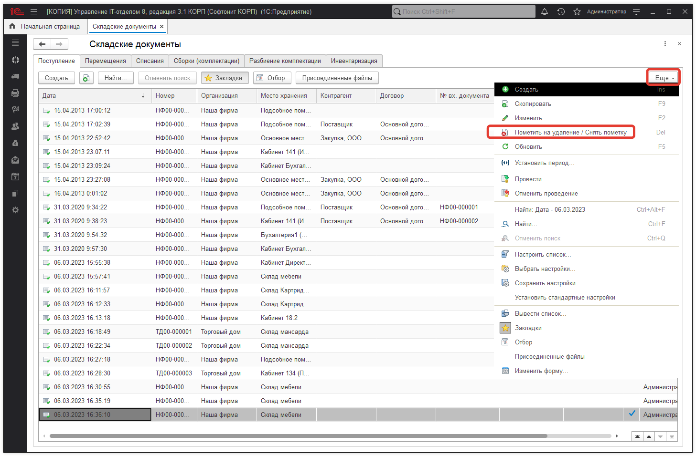

# Как пометить документ на удаление?

Для пометки документа на удаление необходимо [снять его с проведения](https://softonit.ru/FAQ/courses/?COURSE_ID=1&LESSON_ID=101&LESSON_PATH=1.100.413.101) (если он проведен), а затем нажать на кнопку:

Если Вы хотите полностью удалить этот элемент, Вам необходимо пометить данный элемент на удаление, а затем запустить процедуру [удаления помеченных объектов](https://softonit.ru/FAQ/courses/?COURSE_ID=1&LESSON_ID=103).