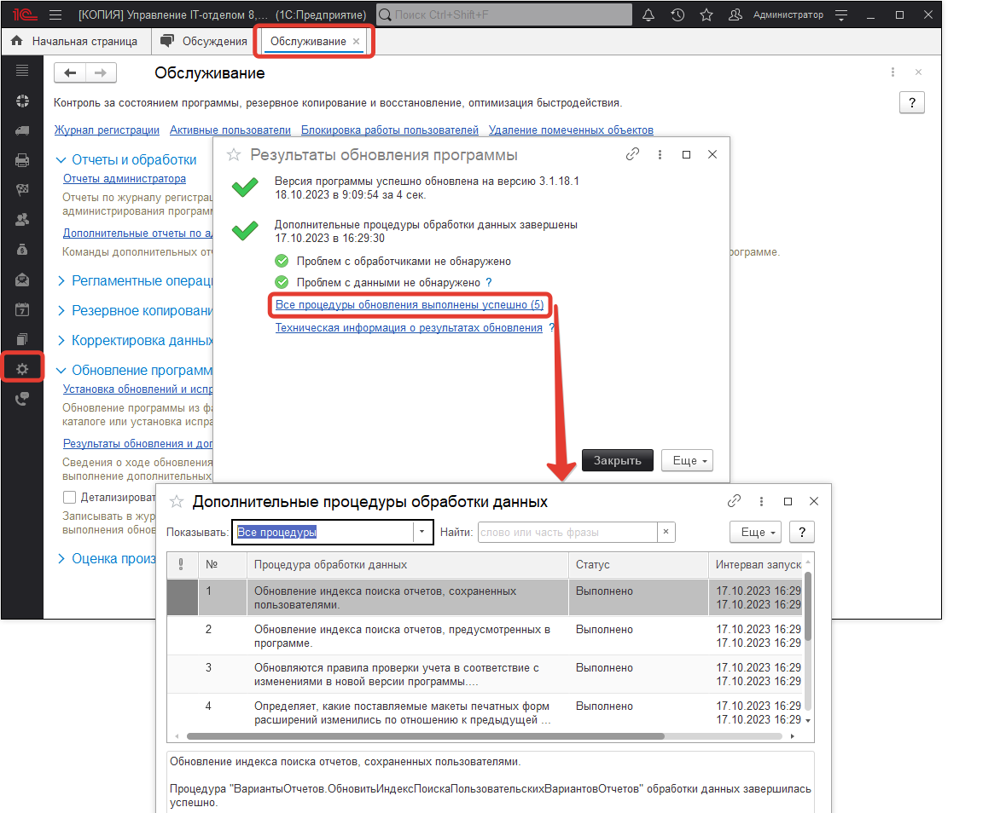
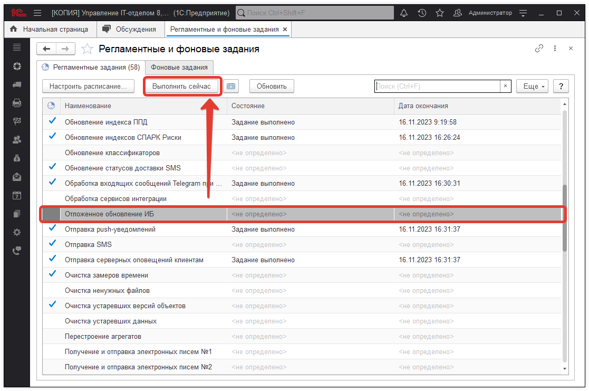

# После обновления - Выполняются дополнительные обработки данных.

Если после обновления версии программы наблюдается такое окно:

то предлагаем сделать следующее:

в разделе **"Администрирование" - "Регламентные и фоновые задания"** запустить регламентное задание "Отложенное обновление ИБ":

