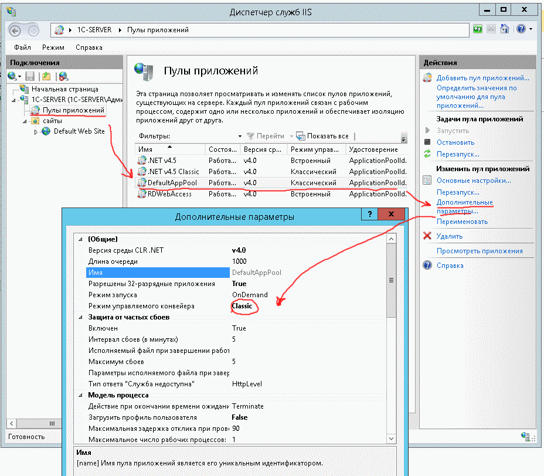

# При использовании IIS в 1С получаем ошибку HttpException (0x80004005)

## Ошибка примерно такая:

```
[HttpException (0x80004005): Обнаружено потенциально опасное значение Request.Path, полученное от клиента (:).]
System.Web.HttpRequest.ValidateInputIfRequiredByConfig() +9914812
System.Web.PipelineStepManager.ValidateHelper(HttpContext context) +53
```

**Алгоритм следующий:** 
1. Открываем IIS.
2. Открываем наш сайт-публикацию в браузере.
3. Идем в сопоставления обработчиков.
4. Ищем ISAPI-dll и выделяем строку.
5. Справа нажимаем "Добавить сопоставление сценария".
6. Путь запроса - "*", Исполняемый файл - "C:\....\wsisapi.dll".
7. Нажимаем "Да".

Если это не поможет, то можно попробовать следующее:



