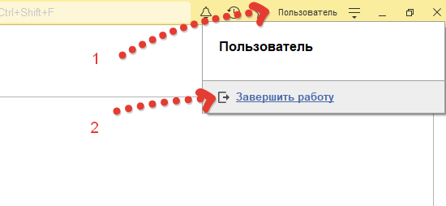

# Проблема зависших сеансов 1с

Иногда в процессе работы возникают случаи, когда зависают сеансы пользователей 1С(особенность платформы от компании 1С). Такое часто случается если завершать работу с базой неправильно (Нажать на крестик в правом верхнем углу программы). Возникает вопрос: «Как правильно закрывать программу 1с?». На рисунке ниже я показываю, более корректное закрытие окна программы 1С: Предприятие: в том же углу нажать на имя пользователя, а затем на гиперссылку «Завершить работу».

Что делать если сеансы все же зависли. При использовании клиент – серверного варианта работы, есть такое приложение как «Администрирование серверов 1С предприятие». Нужно открыть вашу Информационную базу (в примере это UT), по пути, указанном на рисунке ниже, и перейти в «Сеансы». В правой части окна мы увидим список всех сеансов пользователей, работающих с базой, выберем нужный, нажмем правой кнопкой мыши и нажмем «Удалить». Да совершенно верно- все так просто.

При работе в файловом режиме специальных инструментов нет, здесь может помочь банальная перезагрузка компьютера с базой, удаление процессов 1С в «Диспетчере задач», но все их назвать корректными нельзя.