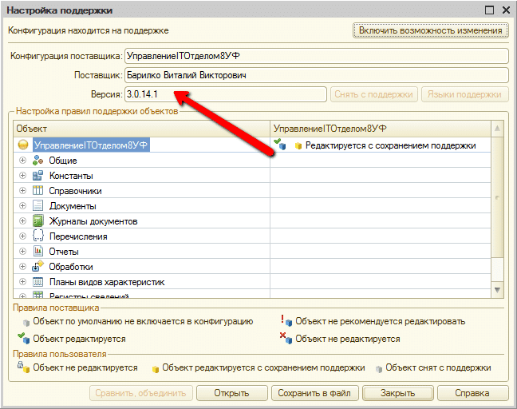

# Проблемы с обновлением. Обновление предназначено для другой версии.

Иногда возникает такая ситуация, когда конфигурация не может быть обновлена на новую версию.  
Установленные обновления платформа "не видит". Это может быть следствием не правильной установки прошлого обновления.  

Первым делом необходимо проверить, какая версия действительно у Вас установлена. Для этого запустите конфигурацию в режиме конфигуратора и проверьте версию в двух местах. Действительно ли та версия установлена.  

1. Посмотрите как версия в "О программе":

2. Посмотрите какая версия в поддержке:
В конфигураторе **Меню > Конфигурация > Поддержка > Настройка поддержки**.

Действительно. Мы убедились, что версия и там и там стоит 3.0.14.1, но при установке следующего обновления, конфигурация пишет:  

`"Данное обновление предназначено для версий 3.0.14.1"`

Но ведь и так установлена данная версия! Верно?  
Если у Вас все как на картинке (понятное дело номер версии может отличаться), то только после этого необходима последовательность шагов, которая поможет Вам обновить конфигурацию.

## Причины такого поведения

Почему система не может найти обновление? Дело в том, что в следствии неправильного обновления такая ошибка может возникнуть, конфигурация внутри, при последнем обновлении, обновилась, но по прежнему считает, что она предыдущей версии. Поэтому при следующем обновлении Вы можете наткнуться на подобную ошибку. Лечится эта ошибка так: конфигурацию необходимо заставить насильно изменить версию "внутри".

## Как решить эту проблему

!!!
Внимание! Все что указано ниже Вы выполняете на свой страх и риск!
!!!

1. Необходимо сделать бэкап конфигурации, чтобы избежать в будущем "головной боли" (***Конфигуратор > Меню > Администрирование > Выгрузить информационную базу***).
***Конфигуратор Меню > Конфигурация > Поддержка > Настройка поддержки***. Щелкаем кнопку "Включить возможность изменения".

3. После этого закрываем окно "Настройка поддержки" и нажимаем на кнопку **"Обновить конфигурацию базы данных" (или F7)**

4. Снова открываем настройку поддержки:

5. И снова как и пункте 3 нажимаем "Обновить конфигурацию базы данных" (или F7)

6. Таким образом мы "отвязали" конфигурацию от поставщика, теперь необходимо ее снова привязать. Для этого Вам необходимо написать в [службу поддержки в личном кабинете](https://softonit.ru/personal/tickets/) с просьбой предоставить cf-файл, для обновления конфигурации, т.к. конфигурация не может обновиться. Мы Вам вышлем "нормальный" cf-файл и Вы его снова привяжите к конфигурации.  
7. 
Итак у Вас есть `cf-файл` с конфигурацией поставщика. Необходимо его загрузить. Для этого нажмите "Конфигуратор > Меню > Конфигурация > Сравнить, объединить с конфигурацией из файла" и выберите файл, который мы Вам прислали с нормальной конфигурацией поставщика. После этого Вам будет выдано предупреждение.

Щелкаем "Да", а затем "Выполнить" и нажимаем в открывшемся окне `"ОК"`.   

После этого необходимо снова как и в пункте 3 нажать "Обновить конфигурацию базы данных" (или `F7`).  

Теперь в конфигурации восстановлена возможность обновления. Конфигурация теперь "думает", что у нее правильная версия и она нормально обновится на следующую версию.
