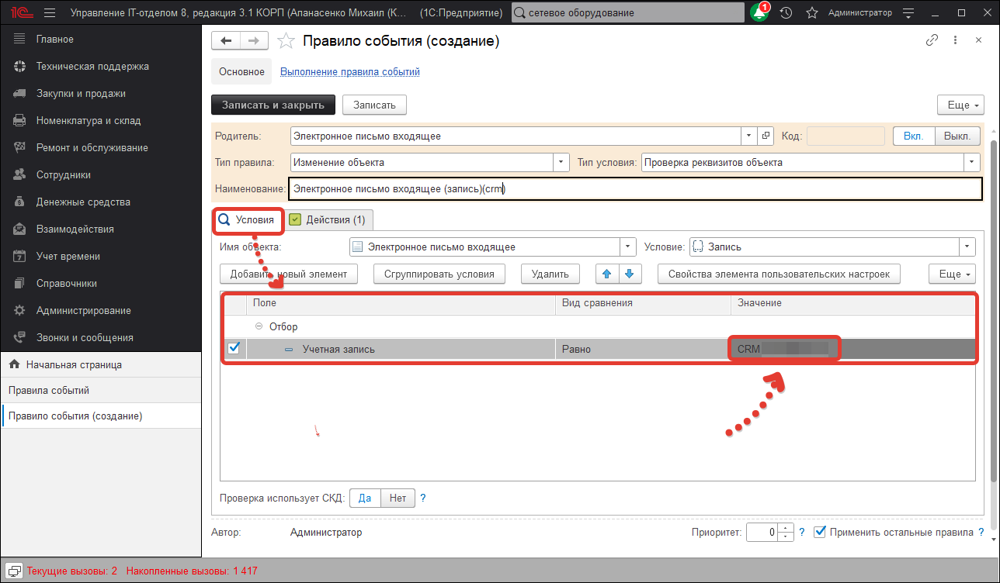

# СRM - подсистема

!!!
**CRM система управления взаимоотношениями с клиентами** - модель взаимодействия, основанная на теории, что центром всей философии бизнеса является клиент, а главными направлениями деятельности компании являются меры по обеспечению эффективного маркетинга, продаж и обслуживания клиентов. Поддержка этих бизнес-целей включает сбор, хранение и анализ информации о потребителях, поставщиках, партнёрах, а также о внутренних процессах компании. Функции для поддержки этих бизнес-целей включают продажи, маркетинг, поддержку потребителей.
!!!

В нашей конфигурации предусмотрена подсистема "CRM". Работа данного функционала схожа с работой подсистемы "Техническая поддержка". Инциденты, поступившие в Service Desk, поэтапно обрабатываются специалистами и доводятся до логического завершения. В CRM все обстоит точно также, чтобы в этом убедиться схематично рассмотрим работу подсистемы:

Что мы видим? Как и у системы обработки инцидентов, цель CRM аналогична, довести обращение до завершения, а именно, это потенциального клиента перевести в статус клиента. Следовательно, механизм технической поддержки полностью подходит для создания ЦРМ, за исключением добавления в работу новой сущности ["Потенциальные клиенты"](https://softonit.ru/FAQ/courses/?COURSE_ID=1&LESSON_ID=635&LESSON_PATH=1.22.634.635). Разберем настройку, на примере.

Первым делом, что необходимо сделать - это создать **процесс** и настроить его **этапы**, по которым будем работать с обращениями потенциальных клиентов. Перейдем в **("Справочники"->"Service Desk"->"Процессы")** и создадим новый процесс "Проявление интереса".

Согласно схеме, представленной выше, настроим этапы процесса следующим образом:
* **Новый** - новое обращение (возможен переход на этапы "Выбор", "Отказ").
* **Выбор** - потенциальный клиент стоит перед выбором продолжения взаимоотношений (возможен переход на этапы "Выставление счета", "Отказ").
* **Выставление счет**а - потенциальный клиент продолжил взаимоотношения и ожидает счета на оплату (возможен переход на этапы "Оплачен", "Отказ").
* **Оплачен** - счет оплачен (возможен переход на этап "Ожидание документов").
* **Ожидание документов** - ожидаем закрывающих документов (возможен переход на этап "Клиент").
* **Клиент** - потенциальный клиент переведен в статус клиента (возможен переход на этап "Работа по договору").
* **Работа по договору**  - работаем с клиентом по заключенному договору (возможен переход на этап "Выставление счета" в случае истечения срока действия заключенного договора).
* **Отказ** - клиент отказался вести взаимоотношения на этапах ("Новый", "Выбор", "Выставление счета").

После переходим к созданию новой учетной записи, на которую будем получать обращения потенциальных клиентов **("Администрирование" -> "Учетные записи электронной почты")**. Стоит заметить, что при использовании подсистемы "CRM" необходимо иметь минимум две учетные записи. Одну использовать для создания заданий на основе инцидентов, а другую для работы с "CRM".

Следующий шаг, это настройка правил событий. Перейдем в *("Справочники" -> "Правила событий")* и создадим/скопируем правило событий "Электронное письмо входящее (запись)" для создания заданий(обращений) на основе входящей электронной почты. 

Заполним реквизиты и добавим новый элемент отбора (**"Учетная запись" = "CRM"**), таким образом при получении почты на почтовый адрес, указанный в данной учетной записи, будет отрабатывать действие к настройке, которого перейдем далее.

Скопируем действие правил событий, которое используется для создания заданий на основании почтовых обращений и изменим его. На закладке "Значения заполнения" изменим реквизиты в соответствии с рисунком выше. Очень важный реквизит в данном случае "процесс", созданный нами ранее и в соответствии, с которым далее будет разделение на "инциденты" и "проявленный интерес" потенциальных клиентов.
На закладке "Инициаторы" необходимо выставить приоритет поиска инициаторов при записи входящего письма. 

Обратите внимание, что сущность "Потенциальные клиенты" находится вверху списка, а также выбрана в поле "Создавать инициатора с типом, если он не найден". При таких настройках после создания задания, потенциальные клиенты будут добавлены в одноименный справочник. 

Для более удобной работы с подсистемой "CRM" можно использовать "Канбан-доску".  Перейдем в *("Техническая поддержка" -> "Группы канбан-доски")* и добавим новые группы, которые будут отображаться на канбан. 

При создании группы, важно не забывать выставлять реквизит "Отображать" в положение "Да" иначе на канбан-доске она не будет отображаться.

После этого создаем новую канбан-доску и добавляем группы, которые создали ранее.

Результат канбан-доски "CRM".

Итог настройки подсистемы.
В документе "Задания" будут созданы задания на основании обращений потенциальных клиентов, поступивших на почту "CRM". Действием правил событий автоматически проставляются реквизиты задания. В справочник "[Потенциальные клиенты](https://softonit.ru/FAQ/courses/?COURSE_ID=1&LESSON_ID=635&LESSON_PATH=1.22.634.635)" добавляется новая позиция и после чего можно приступить к работе с потенциальным клиентом.

Сортировкой по процессам, можно отделить инциденты от проявленных интересов.

**Список ролей для работы с подсистемой "CRM".**
* [x] Выполнение заданий;
* [x] Добавление заданий; 
* [x] Добавление изменение спринтов;   
* [x] Оценка заданий из электронных писем;   
* [x] Просмотр не распределенных заданий;   
* [x] Просмотр отчетов по заданиям;   
* [x] Просмотр чужих заданий;    
* [x] Распределение заданий;   
* [x] Управление процесxсами и этапами;   
* [x] Чтение заданий.  

