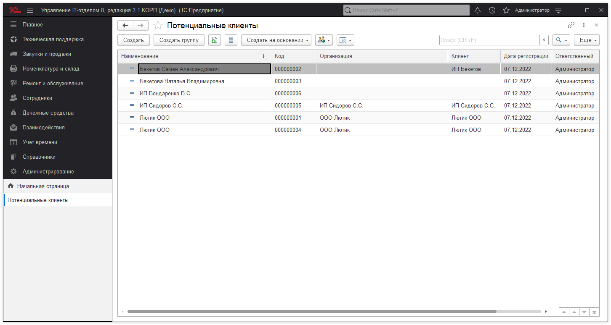

# Потенциальные клиенты

В подсистеме "CRM" находится справочник "Потенциальные клиенты" в нем содержатся организации, которые проявили интерес к нашему продукту и могут стать нашими клиентами.

Форма элемента "Потенциальных клиентов" на закладке "Основное" может содержать следующие реквизиты: 

* [x] Организация;
* [x] Клиент (заполняется, если потенциальный клиент стал клиентом);
* [x] Местоположение;
* [x] Ответственный (выбирается сотрудник, отвечающий за работу с нашей стороны).

Закладка "Адреса, телефоны" может содержать контактную информацию о потенциальном клиенте.

На основе потенциального клиента, можно создать справочники "Контактное лицо" или "Контрагент". Также с потенциальными клиентами можно произвести ряд действий при нажатии на кнопку "Действий".

* [x] Запланировать взаимодействие;
* [x] Запланировать встречу;
* [x] Написать СМС;
* [x] Написать электронное письмо;
* [x] Позвонить.

