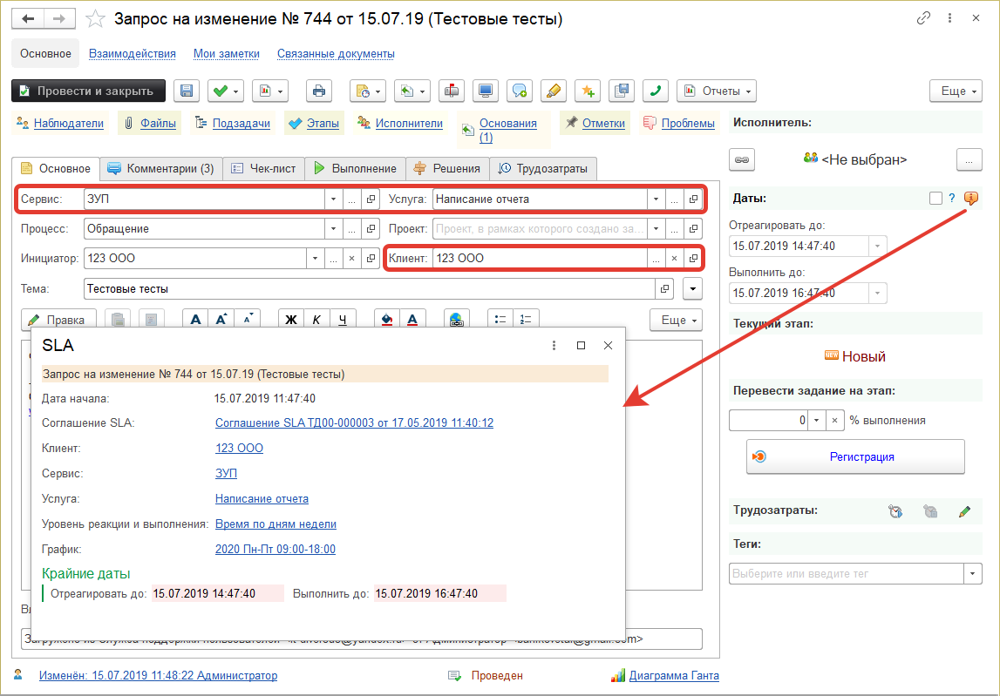
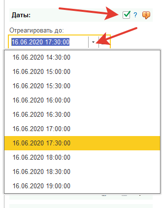

# Автоматический расчет SLA в документе "Задание"

В документе [Задание](https://softonit.ru/FAQ/courses/?COURSE_ID=1&CHAPTER_ID=025), фиксируются инциденты, запросы на обслуживания и прочее. Важным элементом является автоматический расчет времени реакции и времени выполнения.
В предыдущих темах, мы описывали как [настроить время](https://softonit.ru/FAQ/courses/?COURSE_ID=1&LESSON_ID=564) и [заключить SLA](https://softonit.ru/FAQ/courses/?COURSE_ID=1&LESSON_ID=33), здесь же мы опишем как это все работает в задании.
В самом задании есть реквизиты, которые влияют на расчет времени SLA. Прежде всего это:  
* **Дата документа** (когда было начало инцидента)
* **Организация** (кто оказывает услугу)
* **Клиент** (кто за все платит и с кем заключено соглашение SLA)
* **Приоритет** (на сколько все плохо по влиянию/срочности)
* **[Сервис](https://softonit.ru/FAQ/courses/?COURSE_ID=1&LESSON_ID=34)** (какая группа услуг)
* **[Услуга](https://softonit.ru/FAQ/courses/?COURSE_ID=1&LESSON_ID=35)** (собственно, сама оказываемая услуга)
* 
Так же косвенно на авторасчет влияют данные:  
* **Исполнитель** (Пользователь у него есть график работы)
* **Графики оказания услуг** 
Если какие-то реквизиты из перечисленных не заполнены в документе "Задание" ничего автоматически не рассчитается, так как программе не будет хватать сведений для расчета.
В задании можно посмотреть на авторасчет SLA нажав на картинку с буквой "i", рядом с датами "Отреагировать до" (дата реакции) "Выполнить до" (дата выполнения).

В этом расчете становится понятно какие реквизиты берутся для авторасчета и каким алгоритмом этот расчет выполняется. Можно щелкнуть и понять как все рассчиталось.

Рядом с датами есть галочка, которая позволяет изменять даты вручную (если есть такая необходимость)

Даты можно менять только пользователю с ролью "Полные права" или с ролью "**"Доступно изменение дат SLA"**.