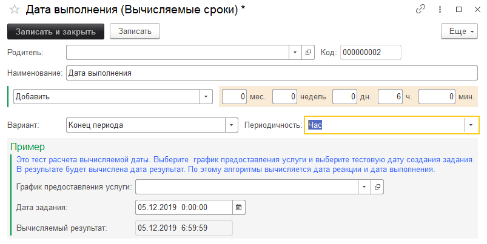

# Вычисляемые сроки

Справочник позволяет выполнить расчет сроков фактических показателей уровня сервиса. Механизм довольно гибкий, с возможностью вывода примера расчета.

**Основные реквизиты:**

* Добавить\Вычесть - выполняет добавление\удаление от указанного значения.
* Месяцев - добавление\удаление указанного количества месяцев.
* Недель - добавление\удаление указанного количества недель.
* Дней - добавление\удаление указанного количества дней.
* Часов - добавление\удаление указанного количества часов.
* Минут - добавление\удаление указанного количества минут.
* Вариант - реквизит, который переводит вычисленную дату к одному из трех значений:
    * Не изменять - не изменяет вычисленную дату.
    * Конец периода - приводит вычисленную дату к концу дня. Пример: 01.09.2019 23:59:59.
    * Начало периода - приводит вычисленную дату к началу дня. Пример: 01.09.2019 0:00:00.
* Периодичность - может принимать одно из следующих значений периода расчета: месяц, неделя, день, час, минута.

