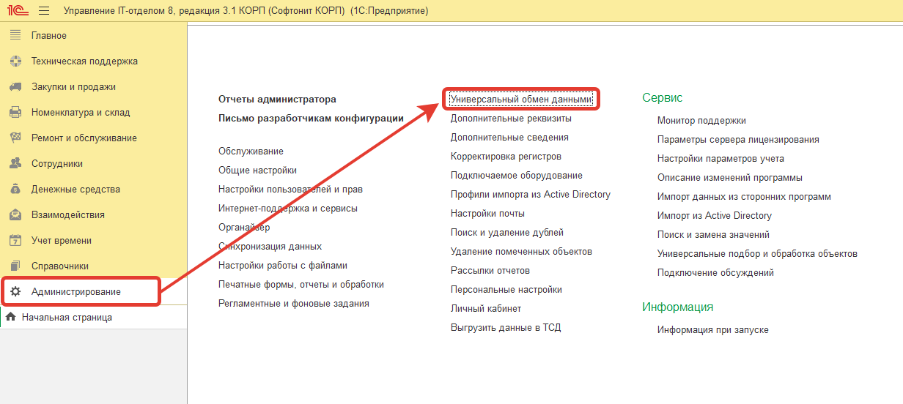
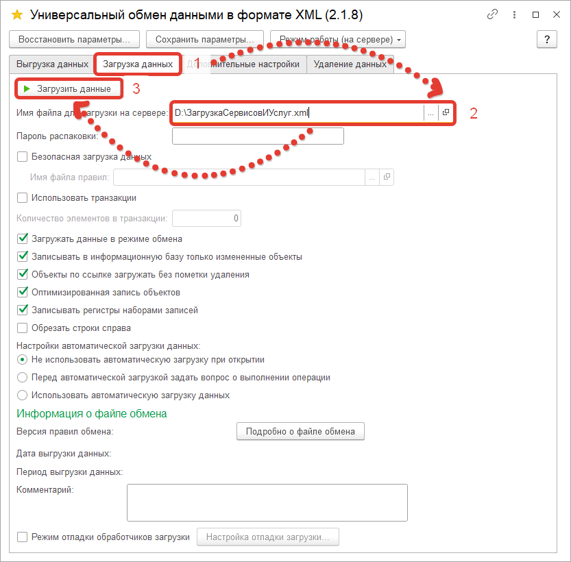
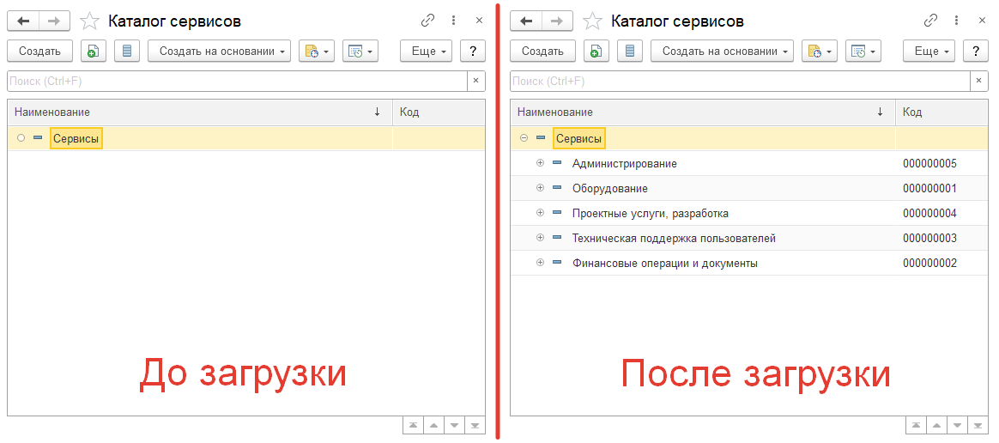
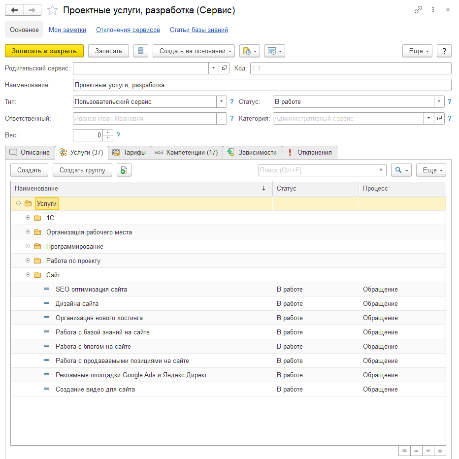

# Как загрузить каталог сервисов и услуг в "Управление IT-отделом 8"

Если вы работаете с нашим программным продуктом «Управление IT-отделом 8» и хотите загрузить сервисы и услуги в базу данных, то эта инструкция для вас.

Для того, чтобы загрузить сервисы и услуги, необходимо загрузить ранее предоставленный файл выгруженных сервисов и услуг в формате XML. [[Загрузить файл]](https://softonit.ru/catalog/products/itcatalog/)
Загрузка выполняется во встроенной обработке «Универсальный обмен данными через XML» в Управлении IT-отделом. Запускаем её: **Администрирование -> Универсальный обмен данными.**

После открытия обработки переходим во вкладку «Загрузка данных» и выбираем XML файл выгруженных сервисов и услуг и загружаем его.

!!!
Внимание! Перед загрузкой рекомендуем сделать резервную копию вашей базы данных. Это позволит вам восстановить данные в случае возникновения проблем.
!!!

Когда загрузка была завершена посмотрим на загруженные сервисы.

Здесь мы видим, что сервисы были загружены. 
Вот пример того, как выглядит загруженный сервис с услугами и компетенциями.

В итоге, загрузка сервисов и услуг - это не сложная задача, которая может быть успешно выполнена при наличии соответствующих инструментов. Желаем вам приятной и продуктивной работы, при использовании этого полезного инструмента для улучшения бизнеса!