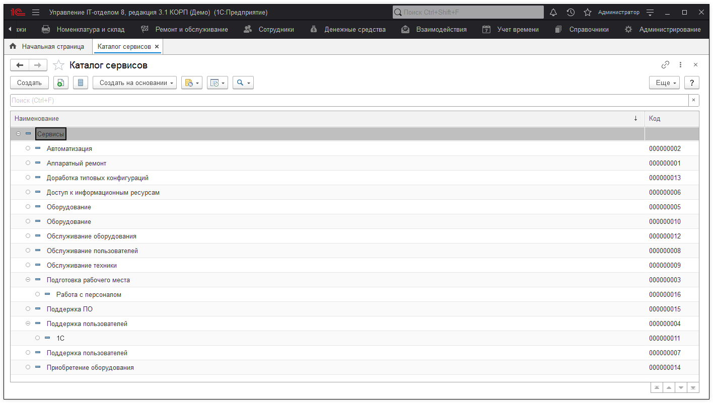
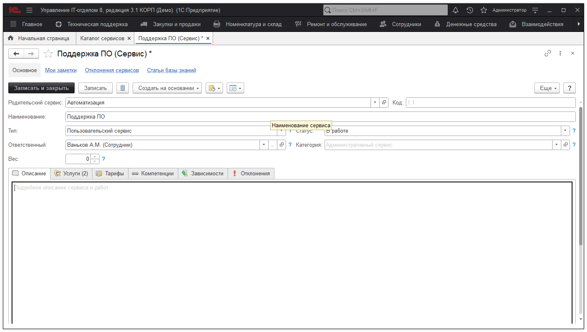

# Сервисы SLA

Сервисами называется комплекс ИТ-услуг, оказываемых клиенту.

Допустим под сервисом "Доступ в интернет" можно понимать комплекс услуг: установка Skype, настройка роутера/модема и т.д. Таким образом, сервис - это логическая группировка некоторых услуг, которые связаны между собой. Например, все перечисленные услуги так или иначе связаны с доступом в интернет из примера выше.

