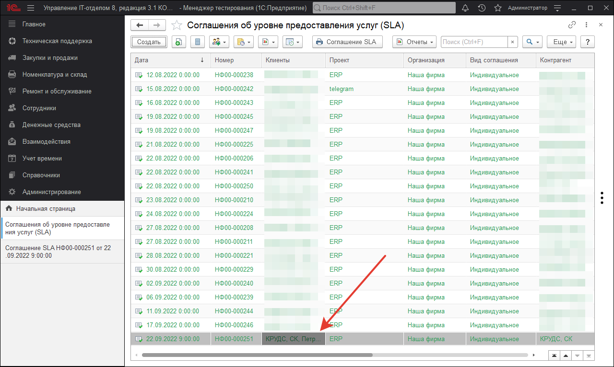
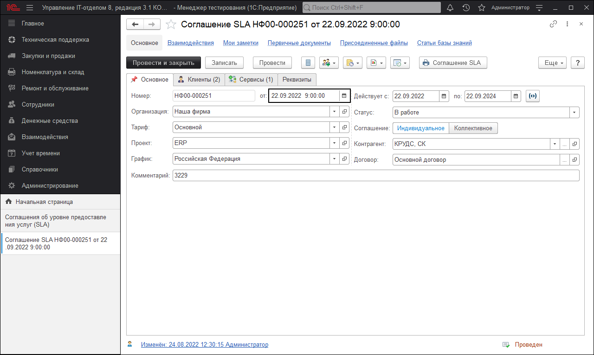

# Соглашение SLA
**Соглашение об уровне предоставления услуги** (англ. Service Level Agreement (SLA)) — термин методологии ITIL, обозначающий формальный договор между заказчиком (в рекомендациях ITIL заказчик и потребитель — разные понятия) услуги и её поставщиком, содержащий описание услуги, права и обязанности сторон и, самое главное, согласованный уровень качества предоставления данной услуги.

SLA используется внутри организации для регулирования взаимоотношений между подразделениями, а также является основным инструментом непрерывной оценки и управления качеством предоставления услуг [аутсорсинга](https://ru.wikipedia.org/wiki/Аутсорсинг) специализированной организацией — [аутсорсером](https://ru.wikipedia.org/wiki/Аутсорсинг).

Как правило, термин **SLA** используется применительно к [ИТ](https://ru.wikipedia.org/wiki/Информационные_технологии) и [телекоммуникационным](https://ru.wikipedia.org/wiki/Электросвязь) услугам. В таком соглашении может содержаться детальное описание предоставляемого сервиса, в том числе перечень параметров качества, методов и средств их контроля, времени отклика поставщика на запрос от потребителя, а также штрафные санкции за нарушение этого соглашения. Для того, чтобы соблюсти SLA, поставщик услуг в свою очередь заключает операционное соглашение об уровне услуг (OLA, operational-level agreement) с другими внутренними подразделениями, от которых зависит качество предоставления услуг.

В идеале, SLA определяется как особый сервис. Это позволяет сконфигурировать аппаратное и программное обеспечение для максимизации способности удовлетворять SLA.

В конфигурации данный документ используется для:

1) Ведения списка соглашений с клиентами

2) На основании данных этого документа в документах "Задание", где выбран документ SLA автоматически подсчитывать время реакции и время закрытия задачи оговоренное в SLA

В этом окне производится управление всеми соглашениями об уровне предоставления услуг. К одному ИТ-отделу может относиться несколько таких соглашений. Отсюда же можно создать новое соглашение.

Также мы можем посмотреть подробную информацию по соглашению, щелкнув по нему два раза в списке.

Здесь мы можем выбрать организацию, к которой относится ИТ-отдел, организацию клиента (причем она может быть как внешняя (контрагент), так и внутренняя (организация)), договор в рамках которого будет действовать данное соглашение и период действия соглашения. Также в этом документе есть возможность указать сервис, уровень сервиса, график и исполнителя по умолчанию. При желании Вы можете присоединить файл к соглашению.

Так же, соглашения могут быть двух видов **Коллективные** и **Индивидуальные**. Коллективные заключаются сразу со всеми и их имеет смысл использовать, когда у вас перед всеми вашими клиентами одни и те же время реакции и выполнения, графики услуг и т.д. Индивидуальные же позволяют сделать под каждого клиента свои условия. При наличии двух видов соглашений для одного клиента, приоритет отдается программой Индивидуальным соглашениям.

В процессе работы может возникнуть ситуация, когда мы сопровождаем клиента ТОЛЬКО по одному или нескольким проектам. Например, у нашего клиента есть две конфигурации 1С ЗУП и ERP, мы сопровождаем ЗУП, а другой подрядчик ERP. В этом случае можно задать отдельно соглашение под конкретный проект, выбрав в качестве проекта ЗУП. Тогда все задачи, которые будут зарегистрированы по ЗУП будут учитываться по SLA, а остальные будут выдавать ошибку при расчете дат SLA. Если проект не выбран, то соглашение действует для всех проектов.

Видео "Сквозной пример использования соглашения SLA в Управлении IT-отдела 8"

https://youtu.be/AYaAEQFMGoo

