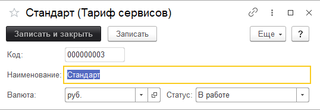

# Справочник "Тарифы"

Справочник предназначен для ведения ценовых групп тарифов для сервисов.
Например тариф "Особый" может быть использован для определения одной категории цены сервисов, а тариф "Стандарт" для другой.

Грубо говоря это категории наших цен, которые используется в соглашениях SLA.