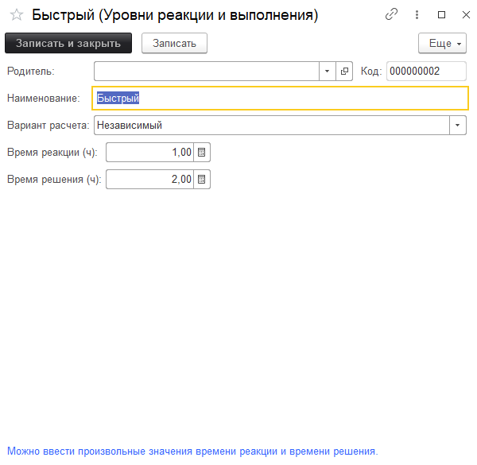
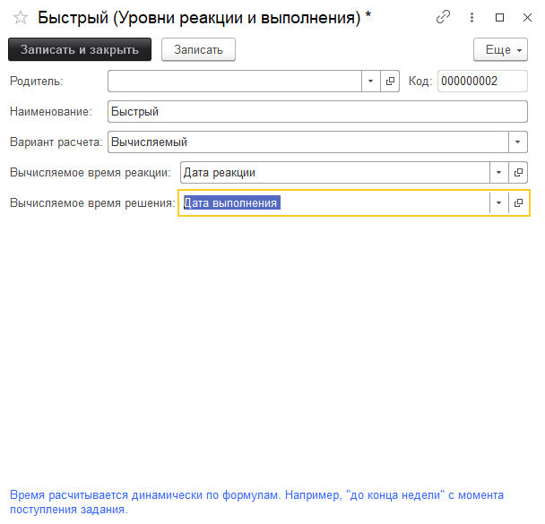
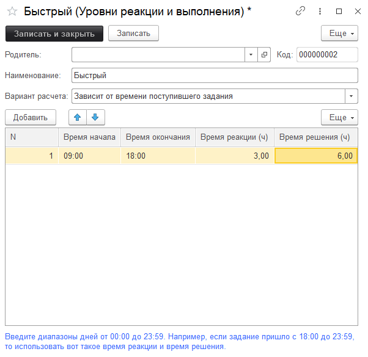
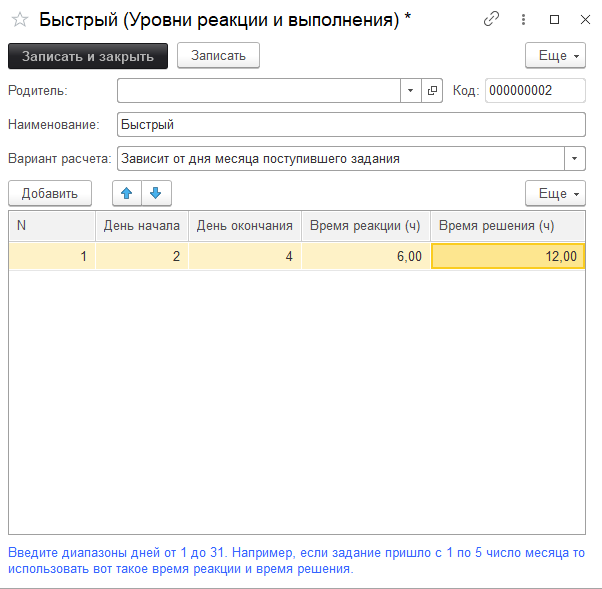
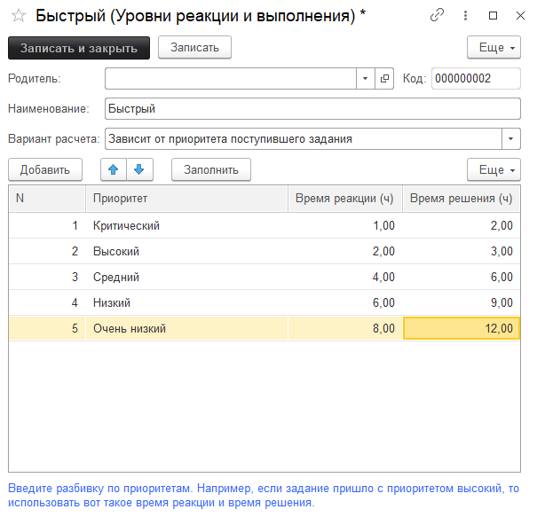
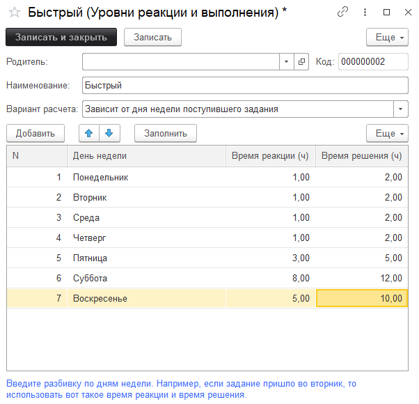

# Уровни реакции и выполнения

Уровни реакции и выполнения позволяют задать различные варианты расчета времени реакции и времени решения. Есть несколько вариантов расчета:

1. **Независимый** - можно ввести произвольные значения времени реакции и времени решения.

1. **Вычисляемый** - время рассчитывается динамически по формулам. [Вычисляемые сроки>>](https://softonit.ru/FAQ/courses/?COURSE_ID=1&LESSON_ID=566&LESSON_PATH=1.22.32.566)

3. **Зависит от времени поступившего задания** - время рассчитывается в введенном диапазоне.

4. **Зависит от дня месяца поступившего задания** - время рассчитывается в введенном диапазоне дней.

5. **Зависит от приоритета поступившего задания** - время рассчитывается в зависимости от приоритета задания, которое пришло.

6. **Зависит от дня недели поступившего задания** - время рассчитывается в зависимости от приоритета задания, которое пришло.

