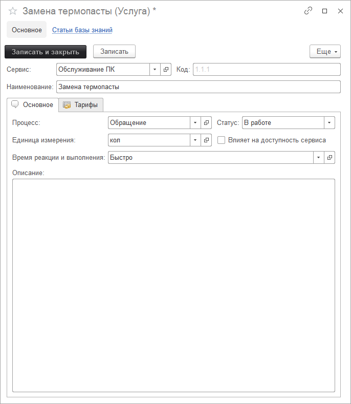
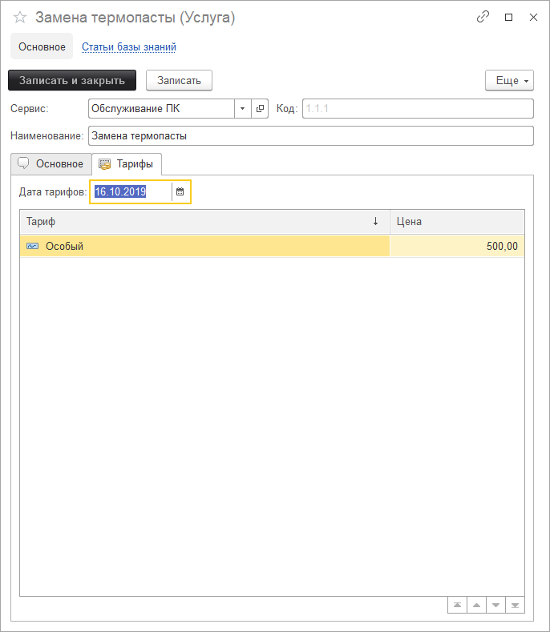
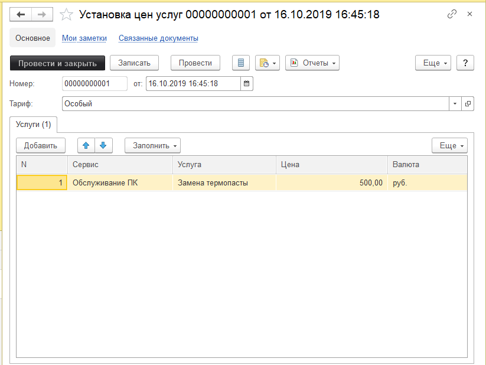

# Услуги сервиса

!!!
**Услуги сервиса** - это ITIL услуги, предоставляемые в рамках определенного сервиса. Другими словами организация, которая предоставляет сервис по обслуживанию компьютерной техники, предлагает клиенту ряд услуг. Как правило, эти услуги нематериальны, например:
!!!

* Аппаратный или программный ремонт компьютера;
* Консультирование;
* Удаленное сопровождение;
* Изменение ПО.
  
На вкладке "Основное", заполняются основные реквизиты справочника.

На вкладке "Тарифы" заполнены тарифы по услуге.

Тарифы создаются документом "Установка цен услуг".

