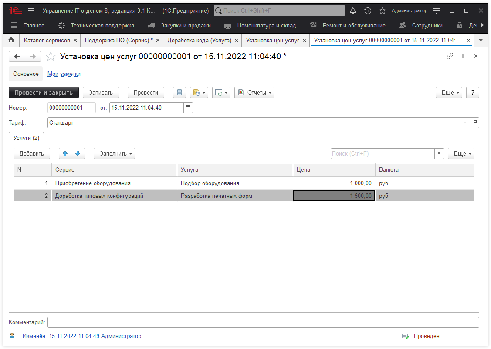
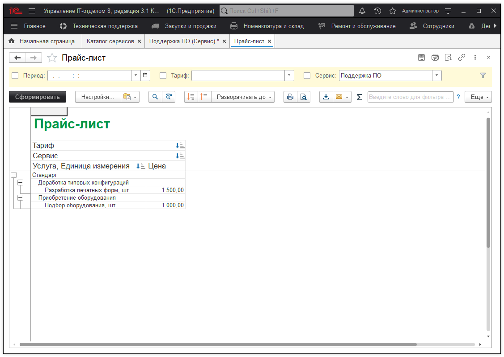

# Установка цен услуг SLA

Документ позволяет зафиксировать стоимость единицы услуги в указанном тарифе.

При этом установленные цены можно посмотреть в отчете "Прайс-лист".

Установленные цены пригодятся нам в документе "Наряд на работы". При выборе сервиса, услуги и тарифа цена в наряде будет установлена автоматически.