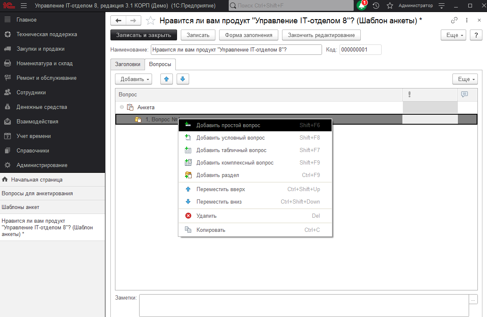
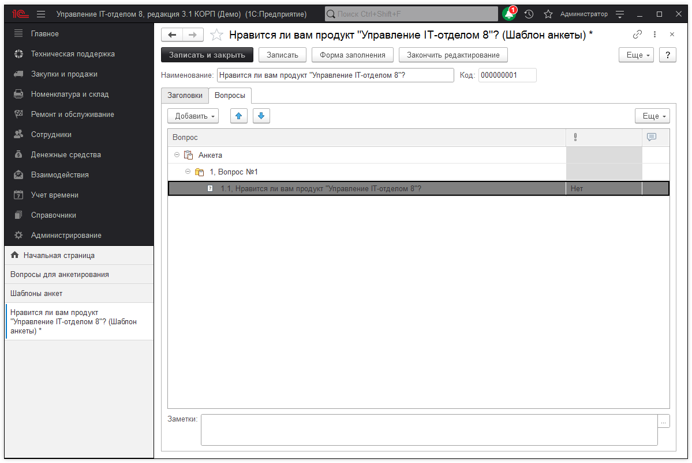

# Анкетирование

Программа позволяет готовить опросы, проводить их среди респондентов, а также анализировать результаты опросов.

В общем случае, работа с анкетированием предполагает следующие этапы:

* **настройка программы** – выполняет администратор программы;

* **подготовка вопросов и шаблонов анкет** – выполняет сотрудник, ответственный за составление анкет;

* **назначение опроса респондента**м – осуществляет сотрудник, ответственный за проведение опросов;

* **заполнение анкет** – во время проведения опроса респонденты могут заполнить свои анкеты;

* **контроль хода проведения опроса** – осуществляет сотрудник, ответственный за проведение опросов;

* **анализ результатов опроса** – проводят сотрудники, заинтересованные в результатах опроса.

Ответственные за этапы подготовки, назначения, контроля и анализа опросов – не обязательно выделенные сотрудники. Выполнение этих этапов может быть поручено и одному сотруднику, который будет заниматься анкетированием в числе прочих своих обязанностей.

Для того чтобы использовать в программе возможности анкетирования, администратору программы необходимо включить флажок **Анкетирование** в разделе **Администрирование – Органайзер – Заметки, напоминания, анкетирование, шаблоны сообщений.**

После включения флажка в разделе **Техническая поддержка** становятся доступными следующие команды:

## Подготовка анкет осуществляется в два этапа:

* Вначале необходимо подготовить вопросы, из которых будет состоять предполагаемая анкета.

* Затем, используя подготовленные вопросы, нужно составить шаблон анкеты.

### Подготовка вопросов

Подготовка вопросов осуществляется в списке Вопросы для анкетирования, который открывается соответствующей командой подменю Анкетирование. В списке содержится общий список вопросов, которые могут быть включены в любую анкету. Эти вопросы называются элементарными, т.к. могут использоваться в качестве элементов более сложных конструкций, например, в табличных вопросах.

Добавим новый вопрос:

В поле **Наименование** напишите краткое представление вопроса, которое выводится при подборе вопросов в шаблоны анкет и используется для поиска вопросов. По умолчанию, текст из поля Наименование автоматически подставляется в поле **Формулировка**.

Вопрос можно включить в одну из групп списка. Для этого выберите группу в поле **Родитель**.

Поле **Формулировка** может содержать развернутый текст вопроса, который будет отображаться респонденту. При этом в шаблоне анкет формулировку можно поменять.

Содержание и формы ответов респондента зависят от значения поля **Тип ответа**.

Тип ответа может быть одним из следующих:

* **Строка** – в этом случае от респондента требуется ввести ответ в виде текстовой информации; при этом ограничение по количеству символов строки задается в поле Длина строки;

* **Текст** – ответ вводится респондентом в текстовом поле неограниченной длины. Длинный ответ можно ввести в отдельном окне;

* **Число** – при ответе на вопрос этого типа респондент вводит число, параметры которого должны быть заданы в полях Длина и Точность. При попытке ввода респондентом числа, которое больше или меньше ограничения, указанного в полях Минимальное значение и Максимальное значение, будет выдано предупреждение о вводе некорректных данных. Включение флажка Агрегировать сумму в отчетах позволяет в отчете Анализ опроса выводить общую сумму по всем анкетам, в которых заполнен ответ на этот вопрос.

* **Дата** – при ответе на вопрос этого типа респондент вводит дату;

* **Булево** – респонденту доступен выбор одного из двух значений: Да или Нет;

* **Выбор одного варианта ответа из предложенных** – с помощью этого типа ответа можно предложить респонденту выбрать один из вариантов ответа с помощью переключателя. Возможные варианты ответов составитель может задать в списке;

* **Выбор нескольких вариантов ответа из предложенных** – респондент может отметить произвольное количество вариантов ответа с помощью флажков. Возможные варианты ответов составитель может задать в списке. Если у варианта ответа включить флажок Требует открытого ответа, то респонденту будет предложено пояснить свой выбор в текстовом поле рядом с вариантом ответа.  

Включение флажка **Попросить респондента прокомментировать ответ**, пояснив характер комментария на этапе подготовки вопроса позволит респонденту при заполнении анкеты в текстовом поле под вариантами ответов разъяснить свой ответ. После включения флажка в поле ниже нужно указать текст, который будет выводиться перед текстовым полем разъяснения респондента.  

Флажок **Попросить респондента прокомментировать ответ**, пояснив характер комментария недоступен при выборе типа ответа Текст и Выбор нескольких вариантов ответа из предложенных. В ответе типа Текст и так можно дать развернутый ответ. Для ответа типа Выбор нескольких вариантов ответа из предложенных при необходимости предусмотрен вывод поля с комментарием для каждого варианта ответа (см. описание типа ответа выше).

### Создание шаблона анкеты

Подготовка шаблонов анкеты осуществляется в списке **Шаблоны анкет** подменю **Анкетирование**.

Создадим новый шаблон анкеты:

Укажите Наименование шаблона.

На вкладке Заголовки введите Заголовок анкеты.

Поле Наименование отображается в списке шаблонов, а Заголовок будет отображаться в анкете при ее заполнении респондентом и в списке доступных анкет.

Анкета может состоять из нескольких разделов, два из которых, Вступление и Заключение, являются обязательными и присутствуют в любой анкете.

На вкладке Заголовки можно ввести тексты разделов Вступление и Заключение. Например, в разделе Вступление можно поприветствовать респондента, а в разделе Заключение – поблагодарить его за заполненную анкету. Текст разделов Вступление и Заключение будут показаны респонденту в начале и при завершении анкеты соответственно.

Для перехода к работе над вопросами анкеты нажмите кнопку Записать. Вопросы можно добавить только после сохранения шаблона.

На вкладке Вопросы можно приступить к формированию списка вопросов анкеты.
В любой анкете содержится как минимум один раздел с вопросами. Если анкета состоит из большого количества вопросов, то для удобства работы респондента с анкетой рекомендуется сгруппировать вопросы по нескольким разделам. Для комфортной работы респондента с анкетой рекомендуется включать в раздел не более 10-15 вопросов.

Структура анкеты представляет собой дерево.

Для добавления нового элемента в шаблон выделите нужное место в дереве (если вводится первый раздел, то необходимо выделить корень анкеты), нажмите кнопку Добавить.
Для примера создадим один раздел шаблона анкеты:

В этом разделе добавим созданный нами ранее вопрос:

После добавления вопроса структура дерева шаблона анкеты должна выглядеть так:

### Назначение опроса респондентам

Для того чтобы респондент приступил к заполнению анкеты по составленному шаблону, необходимо выполнить ряд подготовительных действий. Сначала необходимо организовать проведение опроса, в рамках которого определить сроки его проведения, состав респондентов и шаблон анкеты, на основании которого будут сформированы анкеты респондентов.

Назначением опросов занимается сотрудник, ответственный за проведение опросов, в списке Проведение опросов подменю Анкетирование.

Создадим новый опрос:

В поле **Наименование** указывается заголовок опроса, под которым данная анкета появится в списке доступных анкет у респондентов.
Период проведения опроса задается в полях **Действует с…по**. Поля не обязательны к заполнению. Если период проведения опроса не задан, то такая анкета будет находиться в списке доступных анкет у респондента до тех пор, пока он не ответит на нее.

В поле **Шаблон анкеты** указывается ранее подготовленный шаблон анкеты для этого опроса (выбирается из списка **Шаблоны анкет**).

**Респонденты** – это обычные и внешние пользователи программы. Внешние пользователи программы связаны с такими объектами программы как "Контактные лица" и "Контрагенты".
В поле **Тип респондентов** необходимо указать, для какого типа пользователей программы предназначен опрос.

Затем в список Респонденты необходимо Добавить элементы списков программы, которые могут быть респондентами. Если опрос предназначен для всех респондентов указанного типа, то необходимо включить флажок Свободный опрос. Список Респонденты в таком случае будет недоступен для редактирования.

Если включить флажок Показывать в архиве анкет, то такая анкета будет доступна респонденту в списке архивных анкет. Все свои ранее заполненные анкеты с включенным флажком респондент может посмотреть с помощью ссылки Архив анкет.
Включив флажок Предварительное сохранение, можно разрешить респонденту заполнять анкету в несколько подходов. Если флажок включен, то респондент сможет сохранить частично заполненную анкету с помощью кнопки Записать. Респондент может вернуться к заполнению анкеты в любое время. При этом анкета не будет считаться окончательно заполненной до тех пор, пока респондент не нажмет кнопку Завершить и закрыть. Если флажок Предварительное сохранение не включен, то респонденту нужно будет заполнить анкету за один подход. В анкете для записи будет доступна только кнопка Завершить и закрыть.

### Заполнение анкет

Для того, что бы у респондентов была возможность работать с анкетами, им необходимо добавить роль **Добавление и изменение ответов на вопросы анкет**;а также добавить на начальную страницу форму Доступные анкеты.

Для того, чтобы добавить на начальную страницу форму Доступные анкеты, необходимо перейти **Главное - Рабочие столы - выбрать рабочий стол для редактирования**. 

В нужной группе создать кнопку "Доступные анкеты".

На закладке "Обработчик" нужно выбрать реквизиты **"Открыть форму"** и **"Доступные анкеты"**. 

После входа в программу респондента для него открывается список **Доступные анкеты**.

Если опрос был запланирован с ограничением по времени проведения, то в списке доступных анкет после названия анкеты будет указан срок, до которого необходимо ее заполнить.

Ранее заполненные анкеты респондент может посмотреть по ссылке **Архив анкет** (зависит от настроек при назначении опроса).

По двойному щелчку мыши в списке **Доступные анкеты** можно перейти к заполнению анкеты.

На первой странице анкеты отображается текст из вступительного раздела.

Для перемещения между разделами анкеты можно использовать кнопки Назад и Далее. Также для перемещения по разделам можно использовать навигационный список разделов, видимость которого настраивается с помощью кнопок **Скрыть разделы / Показать разделы**.

Если для анкеты предусмотрена возможность предварительного сохранения, то становится доступной кнопка Записать, по которой можно сохранить частично заполненную анкету, чтобы вернуться к ее заполнению позднее. Если анкета уже заполнялась ранее, но не была завершена, то в списке доступных анкет указывается дата ее последнего редактирования.

Если составителем анкеты были предусмотрены обязательные вопросы, то при попытке завершить редактирование анкеты будет выполнена автоматическая проверка, и респонденту будет предложено ответить на оставшиеся незаполненные обязательные вопросы.

После того как даны ответы на все вопросы, нужно нажать кнопку **Завершить и закрыть**.

Программа выводит сообщение, что дальнейшее заполнение анкеты будет невозможно. Для подтверждения действия нажмите кнопку **Да**, для того чтобы сохранить возможность вернуться к заполнению анкеты еще раз, нажмите кнопку **Нет**.

После подтверждения анкета пропадает из списка Доступные анкеты, но ее можно посмотреть по ссылке Архив анкет. В списке Архив анкет отображаются анкеты, у которых составитель включил флажок Показывать в архиве анкет. Анкету можно открыть двойным щелчком мыши, также можно выделить нужную анкету из списка и нажать кнопку Выбрать.

### Анализ результатов опроса

В программе предусмотрена возможность провести анализ результатов опроса при помощи отчетов **Анализ опроса, Аналитический отчет по анкетированию**. Полный список отчетов, доступ к которым может настроить **Администратор** системы:

**Список ролей для работы с подсистемой "Анкетирование"**
* [x] Добавление и изменение опросов;
* [x] Добавление и изменение ответов на вопросы анкет;
* [x] Добавление и изменение шаблонов анкет;
* [x] Чтение ответов на вопросы анкет.

