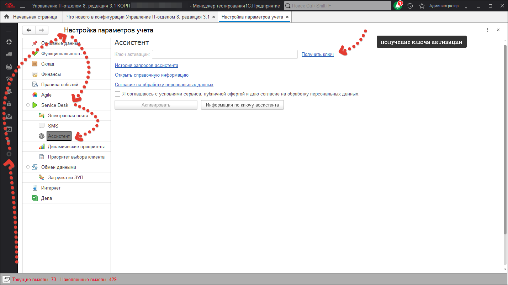

# Ассистент. Инструкция по работе

Начиная с версии 3.1.17.0 появился функционал, выступающий в роли помощника для решения различного рода задач.  Цифровой ассистент реализован на основе ChatGPT, соответственно, функциональные возможности и ограничения будут идентичными.

**Кратко - для чего будет полезно начать использовать:**

1) Ускорить поиск информации
2) Сократить количество рутинных операций
3) В целом, облегчить процесс работы  за счёт различных возможностей

Для того начать работу с ассистентом необходимо перейти в раздел ***«Администрирование»***, выбрать ***«Настройка параметров учета»***, далее в ***«Service Desk»*** -***«Ассистент»*** и перед нами откроется окно.
Прежде всего нам необходимо приобрести ключ для активации. Перейдем по гиперссылке **«Получить ключ»**

После выбора тарифа и приобретения ключа можем вернуться к окну. Установим флаг "Я соглашаюсь с условиями сервиса, публичной офертой и даю согласие на обработку персональных данных." Введем в поле "Ключ активации" приобретенный ключ и нажмем на кнопку "Активировать". После нажатия внизу появится информация по ключу.

Обратим внимание: Кнопка правее "Информация по ключу активации" так же предоставляет информацию по текущему ключу, а гиперссылка "История запросов ассистента" позволит просмотреть на сайте историю  запросов к чату по данному токену.

После того как мы активировали "Ассистента" мы можем его открыть перейдя "Техническая поддержка" - "Сервис" - "Ассистент"

Так же вызов "Ассистента" возможен из документа "Задание" с помощью кнопки.

После запуска "Ассистента" мы увидим окно.

Обратим внимание что  возле поля для ввода текста есть кнопка "ECO". Нажатие данной кнопки  позволяет отключить контекст переписки, что экономит количество токенов.

