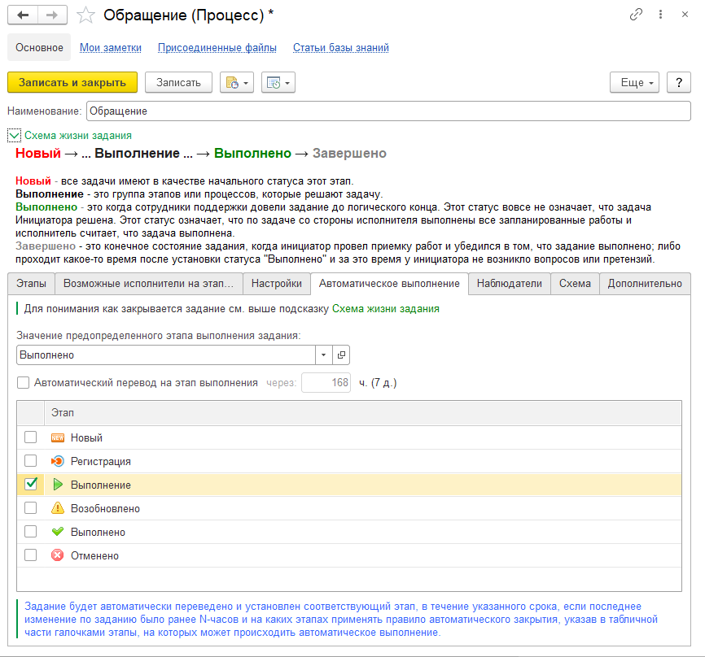

# Автоматическое выполнение и завершение заданий

## Предисловие

!!!
Важно! Обратите внимание, что Выполнено и Завершено по отношению к заданиям - это две разных сущности.
!!!

**Задание Выполнено** - когда исполнитель со своей стороны выполнил все и считает, что он сделал все возможное для Инициатора по его задаче. Этот шаг конечный для задания.

**Задание Завершено** - это виртуальный статус, когда мы со своей стороны все сделали, а потом Инициатор проверил и сказал "да все сделано". Т.е. это не отдельный этап, а обозначение того, что задание выполнено и потом проверено. Ведь может так случиться, что мы выполнили, но Инициатор сказал, что его не устраивает решение и надо переделывать.
Важно не путать эти вещи.

## Автоматическое выполнение задания

Задания могут быть настроены таким образом, чтобы они при отсутствии активности по ним и находясь на каком-то из определенных этапов, в течении какого-то времени, выполнялись автоматически. Для настройки данного функционала необходимо открыть Процесс и перейти на вкладку "Автоматическое выполнение":

Можно указать флагом "Автоматический перевод на этап" будет ли задание с выбранным процессом переведено на указанный этап автоматически, так же указывается период автовыполнения. Период задается в часах. Время автоматическое выполнения начинает отсчитываться от даты последней корректировки задания (для новых заданий автовыполнение не работает).

В табличной части указываются этапы, на которых будет совершено автовыполнение. Т.е. если текущий этап "Выполнение" и дата корректировки заданий на этом этапе будет больше 168 часов, то задание будет автоматически переведено на этап "Выполнено".

При этом будут разосланы все уведомления, как будто бы выполнение было совершено вручную.

Автоматическое выполнение происходит с помощью регламентного задания [Автоматическое выполнение заданий](https://softonit.ru/FAQ/courses/?COURSE_ID=1&LESSON_ID=623) Если автоматическое выполнение не работает, то первым делом необходимо обратить внимание на расписание выполнения регламентных заданий.

## Автоматическое завершение задания.

Вспомним [схему жизни задания](https://softonit.ru/FAQ/courses/?COURSE_ID=1&LESSON_ID=622). По методологии ITIL для завершения задания (инцидента) необходимо дать инициатору время на проверку того, как выполнил исполнитель задание. Часто бывает так, что исполнитель, как он думал, выполнил задачу, но после того, как задание проверил инициатор (т.е. тот, кто поставил задачу), он остается не удовлетворен результатом. В этом случае задание возвращается на доработку и снова происходит итерация: В работе → Выполнено → Проверка → [Завершено (если все выполнено как надо) или снова в Работу (если снова есть недочеты)]
В нашем решении предусмотрено такое поведение системы.
Исполнитель может перевести задание на этап со статусом "Выполнено", а система сама, автоматически должна перевести уже на "Завершено".
При этом завершение происходит, через определенное время (эту настройку можно найти в Администрирование > Настройка параметров учета > Service Desk > Прочее > Интервал автоматического завершения выполненных заданий. И задать интервал в часах.

### Задание будет завершено если:

1. Задание выполнено исполнителем (переведено на этап со статусом Выполнено)
2. Дата последней правки задания больше интервала автоматического завершения выполненных заданий.
3. Автоматически при выполнении регламентного задания "Автоматическое завершение заданий" (проверьте его расписание).
4. Вручную, если пользователь поставил оценку в задании в информационной базе, либо перешел по ссылке и поставил оценку по заданию из электронного письма при выполнении исполнителем.

Важно понимать, что если качество не удовлетворило инициатора, то он может **вернуть задание на доработку** на предопределенный этап "Возобновлено". Это он может сделать следующим способом:

1. Из электронного письма, которое он получил при выполнении инициатором ответив на него;
2. Из электронного письма, которое он получил при выполнении инициатором перейдя по ссылке оценивания и оставив комментарий;
3. Вручную в информационной базе добавив комментарий к переписке;

[Видеоинструкция](https://youtu.be/K5IS3nKkDws)
