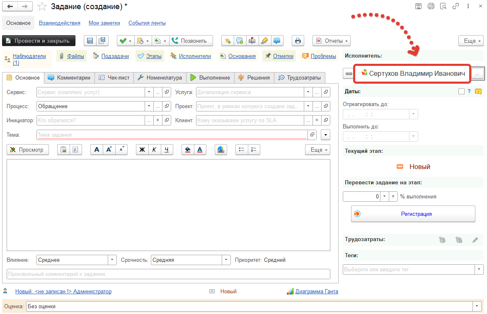

# Автоматическое назначение исполнителя

В конфигурации реализован механизм, который позволяет автоматически назначать исполнителя в документе Задание. Для того, чтобы начать пользоваться им нужно в первую очередь заполнить необходимые реквизиты у пользователя.

**Основные реквизиты пользователя для автоназначения**  
* **Участие в автоназначении исполнителей** - включите флажок, для того чтобы определить участвует ли этот пользователь в автоназначении заданий или нет.
* **График** - заполните для того, чтобы иметь возможность автоназначения с учетом графиков рабочего времени.
* **Линия поддержки** - заполните для автоназначения из фиксированной группы.
* **Местоположение** - заполните для автоназначения с учетом того, откуда задание/проблема.
Возможен сценарий автоназначения пользователя по сервисам, в зависимости от компетенции пользователя (компетенцию, необходимо создать в разделе "Справочники" -> "Компетенции"). В этом случае компетенция должна быть указана у пользователя и сервиса. 

После заполнения реквизитов пользователя, нужно создать новое правило событий.

Далее, нужно создать действие правила события.

## Правила автоназначения исполнителей
 
* **Исполнитель с наименьшей нагрузкой** - будет назначен исполнитель, у которого наименьшая нагрузка.
* **Исполнитель с наименьшей нагрузкой из фиксированной группы** - будет назначен исполнитель, у которого наименьшая нагрузка в указанной группе.
    * **Группа пользователей** - справочник Группы пользователей.
    * **Линия поддержки** - справочник Линии поддержки.
    * **Пользователь** - справочник Пользователи.
* **Исполнитель с наименьшей нагрузкой из фиксированной линии поддержки** - будет назначен исполнитель с наименьшей загрузкой из указанной линии поддержки.
* **Ответственный за сервис** - в качестве исполнителя, будет назначен пользователь или группа пользователей, которая указана ответственной за установленный в задании сервис (при его заполнении).
* **Фиксированная группа исполнителей** - в качестве исполнителя, будет назначена указанная группа пользователей.
    * **Группа пользователей** - справочник Группы пользователей.
    * **Линия поддержки** - справочник Линии поддержки.
    * **Пользователь** - справочник Пользователи.
* **Фиксированный исполнитель** - в качестве исполнителя, будет назначен указанный пользователь.

Настройки завершены.

[Видеоинструкция](https://youtu.be/Ty_nc-aHGco)