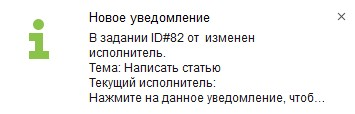
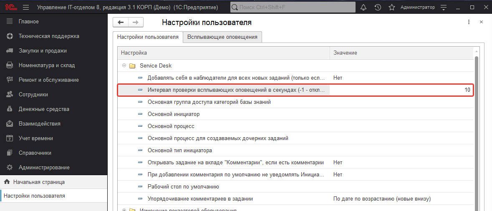
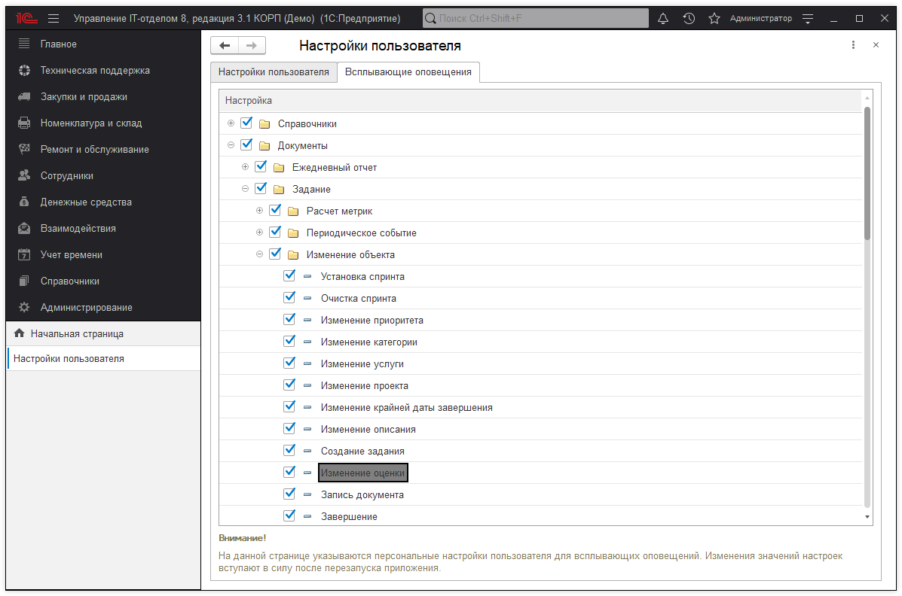
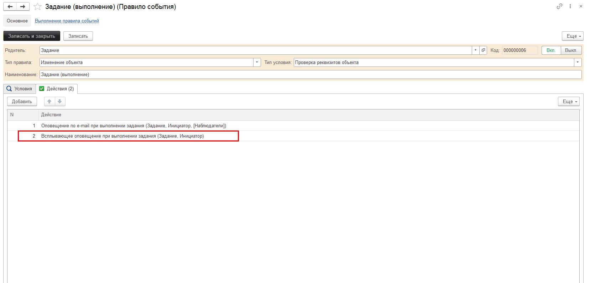
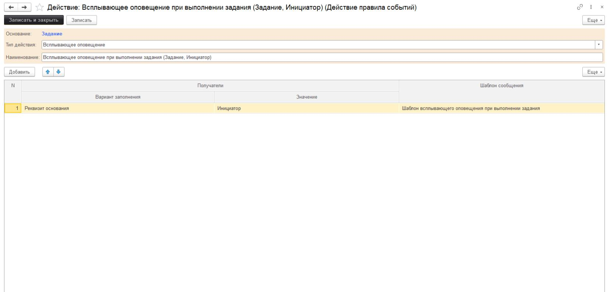

# Всплывающие оповещения для документа "Задание"

--

Всплывающие оповещения помогают быть в курсе  
всех последних взаимодействий с заданиями,  
в которых участвует пользователь.  
Настройки индивидуальны под каждого пользователя.

## Интервал проверки изменений. Включение и выключение всплывающих оповещений.

Перейдите в настройки пользователя (Путь: Начальная страница -> кнопка *"Открыть персональные настройки пользователя"* в виде *"гаечного ключа"* -> *настройки пользователя*). В табличной части раскройте группу "Service Desk". Установите нужные Вам значения в параметре "Интервал проверки изменений заданий для всплывающих оповещений в секундах". После настройки этого параметра, оповещения начнут свою работу.
*Интервал по умолчанию 5 минут. Чтобы отключить, введите значение "-1".*

## Настройка отображаемых оповещений.

В настройках пользователя перейдите в закладку "Настройка всплывающих оповещений".
В табличной части можно выбрать события, которые будут отображаться в всплывающих оповещениях.
*По умолчанию установлено значение "Да" у всех событий.*

## Всплывающие оповещения визуально.

--

Окно всплывающего оповещения.  
Если пользователь нажмёт на оповещение,  
то автоматически попадёт в задание,  
в которое было внесено изменение.  
После перехода по оповещению,  
оно пропадёт из накопленного списка.

Накопленные оповещения. В этот список попадают те оповещения, по которым ещё не был выполнен переход. На накопленные оповещения можно нажать и перейти в изменённое задание. Очистить список можно с помощью кнопки "Очистить". Если программу закрыть, то список накопленных оповещений будет очищен.

--

## Пиктограмма "колокольчик"
Список открывается с помощью кнопки в виде колокольчика на верхней панели программы

## Настройка правил событий для всплывающих оповещений

Настройка всплывающих оповещений в правилах событий ограничивается добавлением действия с типом "Всплывающие оповещения".
В такие предопределённые правила событий как: Задание (выполнение), Задание (добавление обычного комментария), Задание (добавление приватного комментария), Задание (изменение исполнителя) - были добавлены действия с типом "Всплывающие оповещения".

*Пример добавленного действия в правило события:*

Действие с типом **"Всплывающее оповещение"** отвечает за отправку всплывающих оповещений. Табличная часть действия может быть заполнена следующими значениями:

* [x] **"Вариант заполнения" получателя** - может принимать значения **"Реквизит основания"** (будет использоваться значение реквизита или значение параметра из основания) или "Указанный" (тогда в поле "Значение" можно указать произвольного получателя);
* [x] **"Значение" получателя** - имя реквизита (параметра) из основания, либо указанный пользователем получатель.
* [x] **"Шаблон сообщения"** - шаблон сообщения всплывающих оповещений. Для каждого получателя можно создать свой шаблон сообщения с необходимыми параметрами.;

*Действие с типом "Всплывающее оповещение":*

