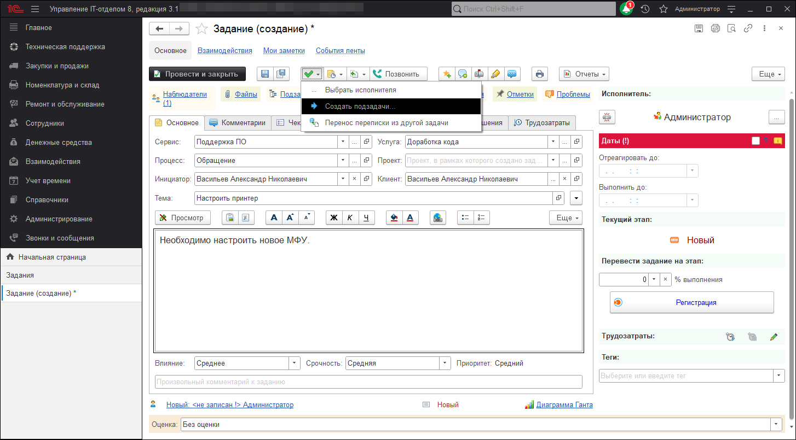
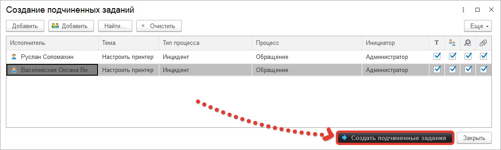

# Выполнение одной задачи несколькими исполнителями
Часто бывает так, что задачу нельзя выполнить одному сотруднику и необходимо задействовать совместные усилия.
Такие задачи тоже можно решать в конфигурации. Для этого необходимо на основании одной задачи создать подзадачи.

**1. Задача изначально:**

2. Разделяем на несколько

Теперь у каждого сотрудника свое задание. После выполнения двух дочерних заданий, основное задание можно закрыть.