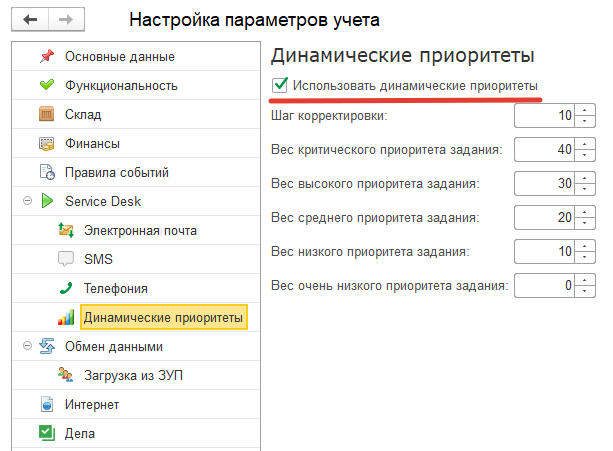

# Динамические приоритеты

*Требования:*

* Версия программы **3.1.3.15** и выше.

При расчете приоритета задания, указания таких реквизитов, как *"Важность"* и *"Срочность"*, возможна ситуация, когда при прочих равных, требуется выделить задания по какому - либо дополнительному признаку: например, задачи от конкретного инициатора (директора или важного контрагента) могут иметь самый наивысший приоритет. Но что делать, если уже есть задачи с критическими приоритетами, но при этом требуется и среди них определить, за какую задачу приступать немедленно? А если такие задания могут поступать периодически? В данном случае, на помощь могут прийти *динамические приоритеты*. Ниже рассмотрим, как работать с этим механизмом.

Прежде всего, необходимо убедиться, что данный функционал включен и настроен. Для этого необходимо перейти в раздел *"Администрирование" - "Настройки параметров учета"*, и для раздела *"Service Desk"* включить флаг *"Использовать динамические приоритеты"* (Рис.1). Тут же, можно установить вес каждого из видов приоритетов (по умолчанию эти значения уже заполнены).

После того, как данный флаг будет установлен, у таких справочников, как *"Группы заданий", "Карточки номенклатуры", "Категории заданий", "Контактные лица", "Контрагенты", "Места хранения", "Организации", "Подразделения", "Пользователи", "Потенциальные клиенты", "Проекты", "Процессы", "Сервисы", "Сотрудники", "Способы создания заданий", "Типы процессов", "Услуги", "Физические лица", "Этапы процессов"* станет доступен реквизит *"Вес"*, а в карточке документа *"Задание"* будут доступны два реквизита *"Вес"* и *"Общий вес"* (Рис.2):

Далее, необходимо в карточках тех инициаторов (либо карточках мест хранения, сервисов и/или услуг и т.д.), задания которых потребуют в дальнейшем первоочередного внимания, необходимо указать соответствующий вес (Рис.3):

После заполнения соответствующих реквизитов перечисленных выше справочников, механизм будет работать следующим образом: при каждой записи документа "Задание" программа будет проверять все указанные в задании реквизиты, и, если для конкретного реквизита документа, в его карточке заполнен реквизит *"Вес"*, то *"Общий вес"* задания будет равен сумме всех значений весов реквизитов. Кроме того, у самого задания также возможна настройка его собственного *"Веса"*. Реквизит *"Общий вес"* в карточке документа *"Задание"* является *"вычисляемым"* и не доступен пользователю для редактирования.

Пользователю, ответственному за распределение (либо выполнение) заданий достаточно лишь выполнить сортировку в форме списка документа "Задание" по полю *"Вес"(общий),* чтобы выстроить задания по убыванию (либо возрастанию) приоритета (Рис.4):

