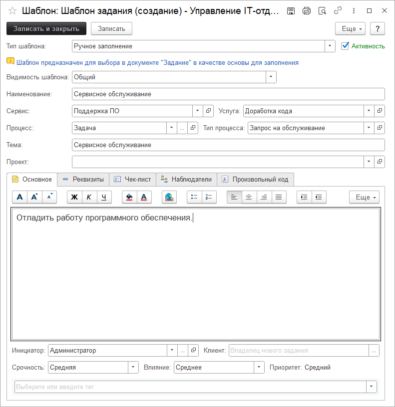
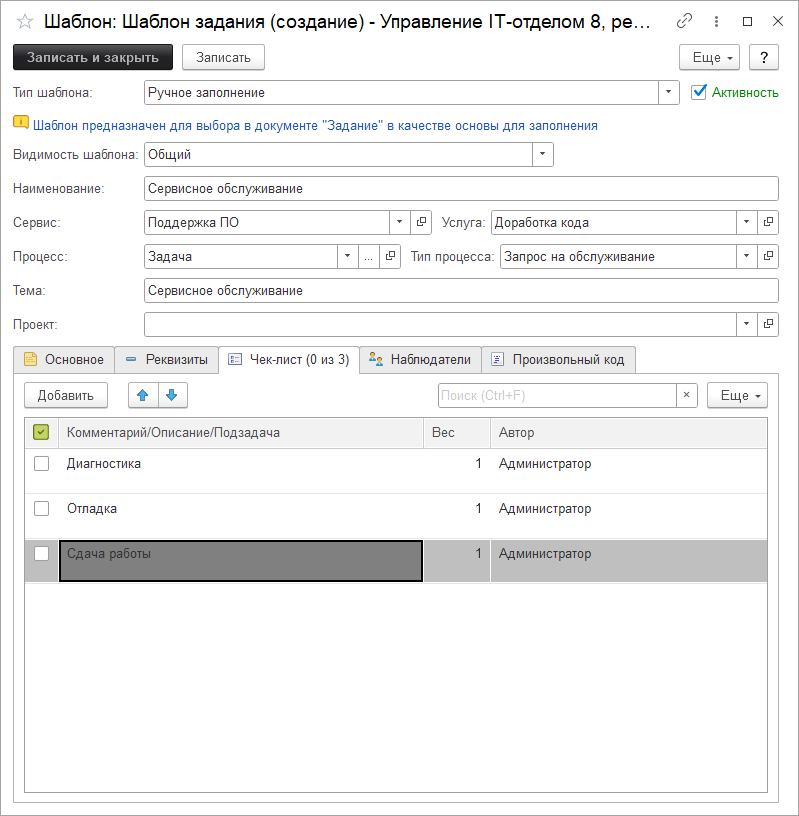
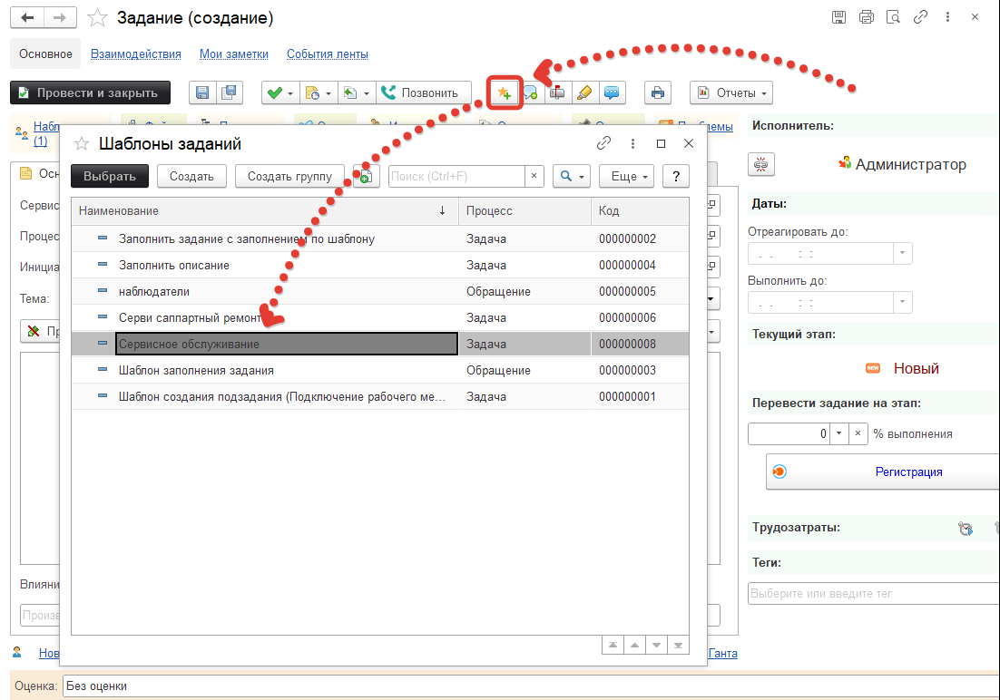

# Заполнение заданий по шаблонам

Часто бывает так, что к нам постоянно приходят одни и те же задания, которые мы как под копирку постоянно используем.
В этом случае имеет смысл использовать шаблоны заданий. Открыть их можно в подсистеме **"Техническая поддержка - > Шаблоны заданий"** и работают они аналогично шаблонам, которые создаются по расписанию, за исключением типа шаблона.
Вот пример шаблона, все жизненно:

А вот вкладка чек-лист:

Создадим задание и заполним его по шаблону:

Ну и вот он в списке шаблонов (если снять в шаблоне "Активность", то его не будет видно в списке). После выбора шаблона документ перезаполняется данными шаблона.

!!!
Важно! Если реквизит в шаблоне не будет заполнен, то он не очистится в документе при заполнении. Это позволит частично заполнить задание вручную, а потом выбрать шаблон и заполнить задание полностью. Либо использовать несколько шаблонов для заполнения одного задания.
!!!
