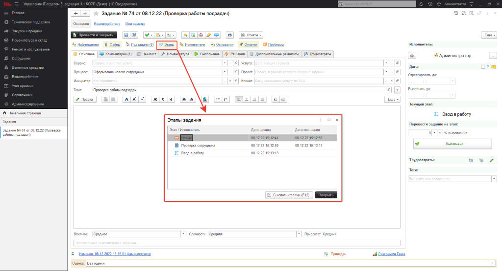
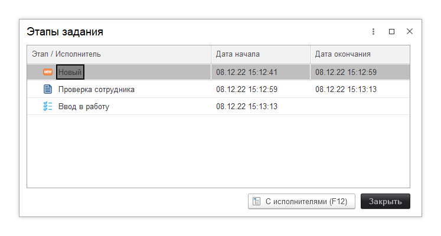

# Контроль изменения этапов задания

Руководителю Service Desk или ИТ-отдела обязательно нужно контролировать ход выполнения заданий. Выполнение заданий определяется с помощью этапов процесса и для этого в конфигурации предусмотрен механизм, который отражает информацию о переводе задания на тот или иной этап. Чтобы воспользоваться функционалом, перейдем в форму документа "Задание", по которому хотим просмотреть информацию о переводах на этапы и в верхнем меню команд, нажмем гиперссылку "Этапы". 

Перед нами откроется табличная часть *"Этапы задания"*, в которой отражен список всех задействованных этапов данного задания. При этом с точностью до секунды указана дата начала и дата окончания этапа. Давайте подробней разберем процесс отражения дат. Для разных типов этапов даты выставляются по-разному, что это значит? Для этапа "Новый" дата начала фиксирует дату и время создания этого задания в программе, а дата окончания будет отражать дату перевода задания на следующий этап. Для этапа *"Выполнение"* все проще, дата начала и окончания фиксируют изменение этапа. То есть, задание переведено на выполнение - дата начала зафиксирована, задание переведено на следующий этап - дата окончания зафиксирована. С этапами типа "Выполнено" ситуация обстоит сложнее. Дело в том, что у данного этапа фиксируется интервал с момента перехода на этот этап, до момента полного завершения задания. Другими словами, перевели задание на этап "Выполнено" - дата начала отразилась, а дата окончания будет зафиксирована, когда задание полностью завершится.  

Данный функционал позволяет также отразить пользователя, который являлся исполнителем задания на соответствующем этапе. Для этого необходимо нажать кнопку *"С исполнителями"* или F12(быстрый вызов).

