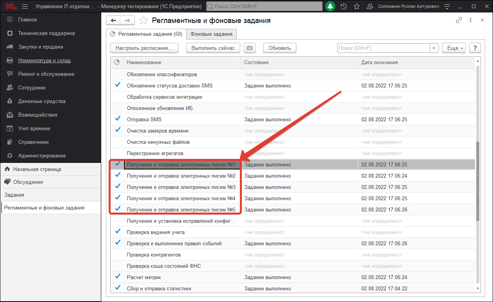
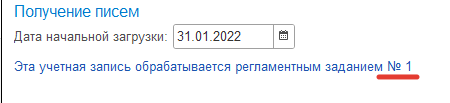
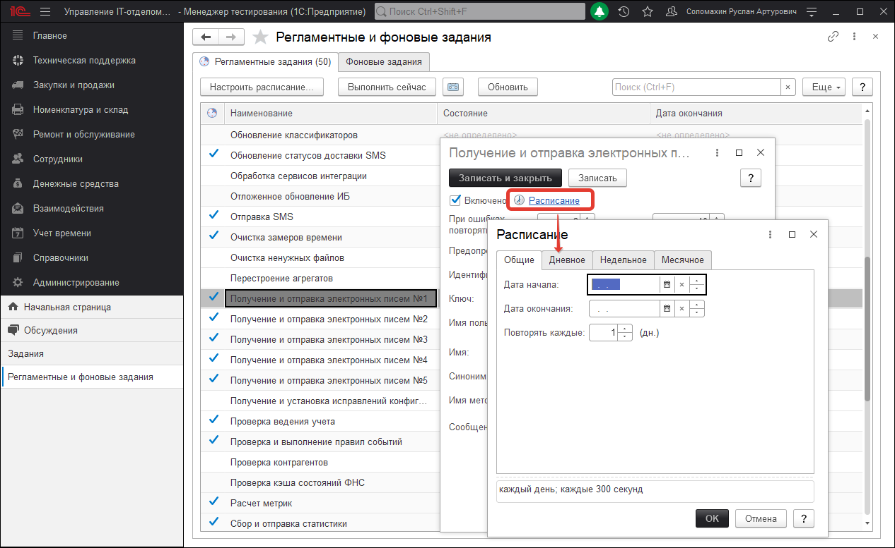

# Настройка автоматического создания заданий и рассылки оповещений.

Для настройки регламентных заданий необходимо открыть обработку *(Администрирование > Регламентные и фоновые задания)*:

Она отвечает за выполнение регламентных заданий. В ней необходимо найти регламентные задания, которые отвечают за загрузку заданий из почтового ящика «Получение и отправка электронных писем №1..5». Каждое регламентное задание по отправке почты, будет автоматически связано с определенной системной почтой, которая настроена в программе. Способ привязки регламентного задания осуществляется автоматизировано и воздействовать на него нельзя. Единственное, для того, чтобы точно определить какое регламентное будет осуществлять получение и отправку писем, нужно перейти в настройки почты. Для этого перейдите в раздел **"Администрирование"-"Настройки почты"**. В настройках любой из настроенных учетных записей почты, Вы сможете увидеть какое регламентное отвечает за обработку (см. скриншот).

После того, как определили точно какое регламентное задание отвечает за обработку, перейдем к настройке его расписания. Настройте ее запуск в соответствии с тем, как бы часто Вы хотели выполнять фоновые задания по загрузке и отправлять рассылку оповещений.

В серверной информационной базе после установки повторов выполнения регламентных заданий. Фоновые задания выполняются автоматически. Т.е. автоматически отправляются оповещения подписанным пользователям и создаются задания на основании писем.
Если у Вас файловая база, то выполнение фоновых заданий в файловой базе, отличается от выполнения в серверной.