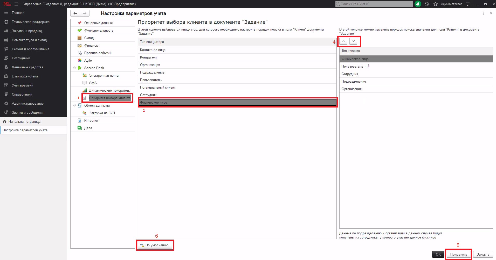

# Настройка заполнения реквизита "Клиент" в зависимости от выбранного инициатора

## Настройки механизма

Начиная с версии 3.1.15.8 изменено поведение заполнения реквизита "Клиент" в документе "Задание". Теперь механизм работает одинаково для любого варианта создания задания. Более того, он стал более гибким и настраиваемым.
В настройках параметров учета добавлен новый пункт - "Приоритет выбора клиента"(1).

Когда переходим в этот раздел, то видим две колонки: **"Инициатор" и "Клиент"**  
В колонке "Инициатор" перечислены все справочники, к которым может относится инициатор. Выделив любой из пунктов, в правой колонке "Клиент"(2) станут доступны все типы клиента, связанные с инициатором (3).  
В этой колонке они расположены той последовательности, как будет происходить поиск - чем выше тип, тем больше приоритет для поиска. Над колонкой расположены две кнопки для перемещения строки вверх или вниз (4).  
Выстроив список в нужном порядке, не забудьте нажать кнопку "Применить" (5) в нижней части формы.
Если что-то пошло не так и необходимо "сделать все как было" то это тоже не проблема. Под левой колонкой расположена спасительная кнопка  "По умолчанию" (6).    Если нажать на нее, то механизм заполнит все так, как было предусмотрено разработчиком.  

## С настройками закончили и перейдем к тому, как это работает в документе

Здесь ничего особо не изменилось. Мы так же выбираем инициатора (если делаем документ "руками") и в поле "Клиент" подставляется автоматически (если есть, что подставлять). Единственное что изменилось - приоритет поиска подходящего значения, который мы настроили раньше.  
Следует отметить, что прямой связи между элементами справочника "Физические лица" с организациями и подразделениями нет. Поэтому если в базе нет сотрудника с данным физ.лицом, то данные об организации и подразделении мы не получим. Похожим образом дело состоит и с пользователем: если у пользователя не указано подразделение, от организацию мы так же не сможем получить.  
Начиная с версии 3.1.15.7 появился механизм, который многие просили. Он позволяет настраивать правила выбора клиента в зависимости от типа инициатора. Данных механизм распространяется на задания, которые создаются в ручном режиме, через почту, телеграмм, личный кабинет и мастера регистрации.Так же механизм задействован и при создании шаблона задания.  
