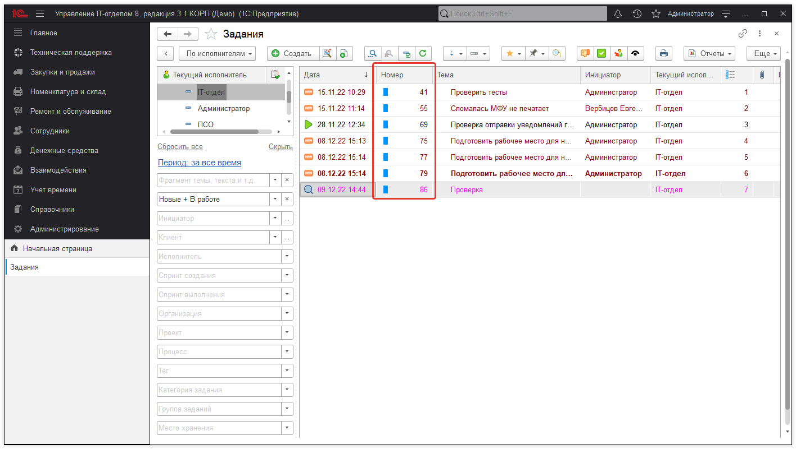

# "Номер числом" и "Номер строкой" в форме списка документа Задание

До версии **3.1.12.6** все документы "Задание" в системе имели строковую нумерацию и номер представлял собой строку вида **"00000000653"**.
С точки зрения интерфейса это выглядело не очень... Используется куча нулей и это мешает восприятию.

Иногда, в номер добавлялся префикс, но в целом номер должен быть всегда уникален.

С версии 3.1.12.6 мы решили изменить это поведение и добавили **по умолчанию** возможность использования **номера числом**. Вот теперь как это выглядит:

Все гораздо компактнее и лучше для восприятия.

Для тех, кто хочет использовать номер строкой из-за префиксов, мы оставили такую возможность. Для этого необходимо открыть в этой форме справа сверху Еще > Изменить форму. В открывшемся окне необходимо найти в списке реквизитов Ссылка, установить фокус на этот реквизит и щелкнуть "Добавить поля". Отроется еще одно окно и в нем необходимо найти Номер. После чего нажать Ок, далее Применить. А со старого реквизита Номер (который числом) снять галочку отображения. В этом случае будет отображен номер строкой, вместо номера числом.