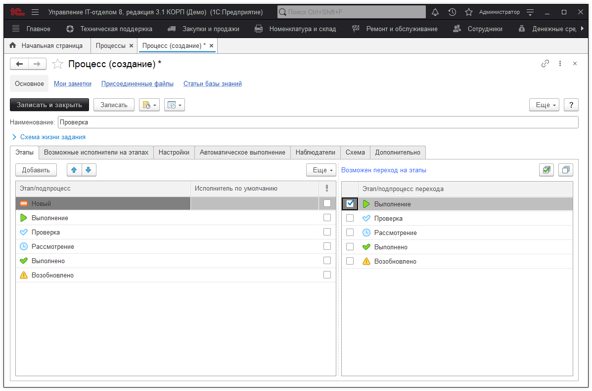

# Осуществление проверки выполнения задания

Обычно определенные задания, которые имеют повышенную важность или сложность в выполнении должны подвергаться проверки квалифицированным специалистом или руководителем. Для того, чтобы убедиться, что все выполнено в полной мере и не допущены в ходе выполнения ошибки. В конфигурации задания определяются выполненными или новыми и т.д., благодаря этапам процессов, переводя, которые задача переходит на ту или иную стадию. Следовательно, когда задание выполнено оно должно быть переведено на этап "Проверка", а уже после проверки может быть либо исправлено, либо выполненным. При всем при этом сотрудник, который выполнял эту задачу не должен иметь право самостоятельно установить статус "Выполнено", так как не была осуществлена проверка. В данном уроке рассмотрим способ, как настроить документ "Задание" таким образом, чтобы исполнитель мог выполнить задачу и отправить ее на проверку своему руководителю.

Переходим в раздел "Справочники" - "Процессы" и создаем новый процесс, который будет использоваться в заданиях подобного характера. Заполняем реквизиты процесса, находящиеся вверху и переходим к настройке табличной части "Этапы". В табличную часть нужно добавить список необходимых для данного процесса этапов. Список этапов будет выглядеть следующим образом:

* [x] Новый
* [x] Выполнение
* [x] Проверка
* [x] Рассмотрение
* [x] Выполнено
* [x] Возобновлено

После добавления нужных этапов в обязательном порядке расставляем связь переходов между ними. Перейти с этапа "Новый" на этап "Выполнение" и т.д. Следующим шагом у каждого из этапов, необходимо установить исполнителя по умолчанию, то есть данный сотрудник будет указан автоматически в качестве текущего исполнителя в задание. На этапах "Новый", "Выполнение" и "Возобновлено" исполнителя по умолчанию укажем сотрудника, который будет отправлять задачу на проверку своему руководителю. А на этапах "Проверка", "Рассмотрение" и "Выполнено" исполнитель по умолчанию должен быть установлен сотрудник, осуществляющий проверку выполнения задания. В результате настроенный процесс будет примерно таким:

После этого, все, что остается это запретить сотруднику, который отправляет задание на проверку, переводить эту задачу на этапы, где он не является исполнителем. А именно это этапы "Проверка", "Рассмотрение" и "Выполнено", для этого нужно отключить у него роль "Распределение заданий". 
