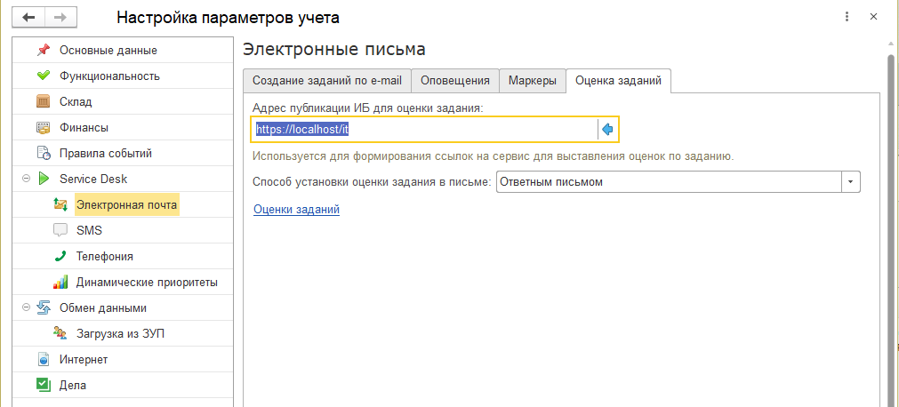
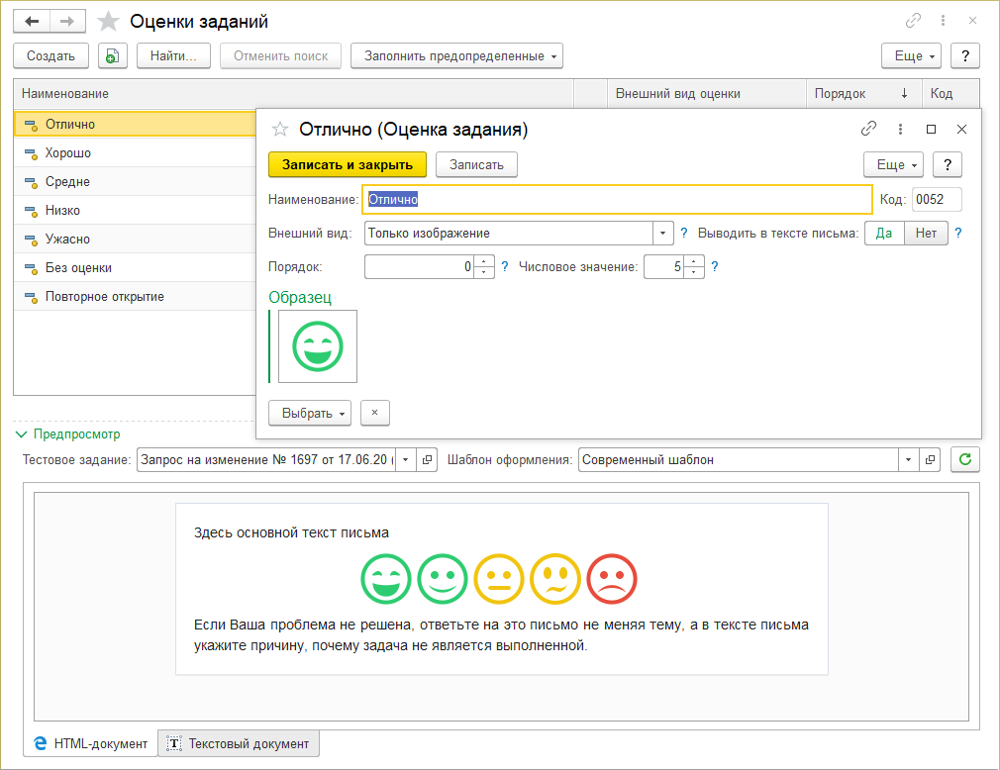

# Оценка заданий и определение лояльности пользователей техподдержки

Не секрет, что сотрудников техподдержки необходимо постоянно держать в тонусе. Не должно быть ситуаций, когда инцидент можно выполнить сейчас, а можно и послезавтра.
Лояльность и удовлетворенность клиентов оказанными услугами вырабатываются месяцами и это можно потерять в один момент просто потому, что не вовремя или не так как надо будет оказана услуга или выполнен запрос на обслуживание.
Для этого и существует оценка заданий (инцидентов).

!!!
**Механизм оценки заданий (инцидентов)** позволяет конечному пользователю (потребителю услуг) оценить каждое задание установив по нему оценку (если задание выполнено) и при необходимости вернуть задание на доработку (если задание не выполнено).
!!!

Ситуация когда исполнитель считает, что задание выполнено, а инициатор проверяя эту работу видит, что исполнитель сделал совсем не то, появляется очень часто. Поэтому иметь возможность вернуть задание в доработку конечному клиенту очень важно. Так как это инструмент влияния на исполнителей заданий заставляет их работать эффективней и лучше.

## Настройка

Чтобы выполнить настройку оценок, необходимо открыть подсистему **Администрирование > Настройки параметров учета > Service Desk > Оценка заданий**

Есть два способа установки оценки заданий из письма:

### Через личный кабинет

Этот способ подходит тем, кто использует подсистему личный кабинет. Подробная настройка этого способа приведена в этой статье.

### Ответным письмом

Этот способ проще, так как не надо ничего настраивать. Пользователю приходит письмо с просьбой оценить выполненное задание, пользователь оценивает нажимая гиперссылку, создается новое письмо с уже заполненными полями адресат (адрес техподдержки), темой (предопределенная, ее не нужно менять) и текстом.
При отправке этого письма будет установлена оценка заданию.

## Справочник "Оценки заданий"

Сам справочник нужен для настройки внешнего вида. Внешний вид может быть двух видов: только текст или только изображение. Если будет выбрано "Только текст", то оценка в письме будет представлять собой кнопку с цветом фона и цветом текста, ну и самим текстом. Если же будет выбрано "Только изображение", то в качестве оценки будет выведена картинка.
Все реквизиты этого справочника просты и понятны.

Подробнее можно ознакомиться с этим механизмом [в видео.](https://youtu.be/Hn07tk_mvXU)
