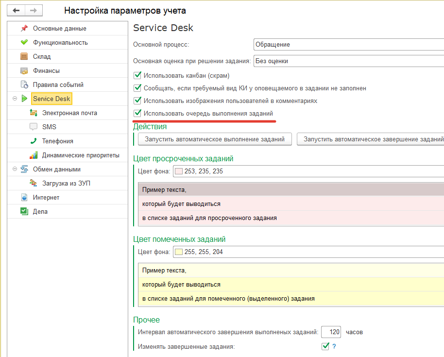

# Очередь выполнения заданий

**Требования:**

* Версия программы 3.1.3.15 и выше.

Возможны ситуации, при которых, перед назначением исполнителя в задании, либо ином контроле исполнителя, необходимо получить информацию о том, над каким именно заданием сейчас работает пользователь, в какие сроки он закончит работу над очередным заданием, какое задание пользователь будет выполнять следующим в его списке заданий и т.д. Для работы с очередью выполнения заданий и предназначен следующий механизм: он позволяет устанавливать и просматривать очередность выполнения заданий исполнителями.

Прежде всего, необходимо убедиться, что данный функционал включен и настроен. Для этого необходимо перейти в раздел *"Администрирование" - "Настройки параметров учета"*, и для раздела *"Service Desk"* включить флаг *"Использовать очередь выполнения заданий"* (Рис.1).

При первом включении данного флага, программа предупредит, что для всех исполнителей заданий будут заполнены их очереди выполнения, и при большом количестве заданий, находящихся в работе у пользователей, это может занять некоторое время. Необходимо согласиться с данным предупреждением и дождаться окончания данной процедуры. Важно отметить, что при первом заполнении очереди выполнения, все задания, находящиеся в работе у пользователя, будут помещены в очередь по их дате создания, т.е. задание с самой ранней датой создания будет помещено первым в очереди.

После включения механизма, для пользователей, которые указаны в заданиях как текущие исполнители, становится возможным просмотр номера в очереди выполнения каждого назначенного ему задания, находящегося в работе (Рис.2):

а у пользователей, имеющих роли *"Распределение заданий"* либо *"Полные права"* еще и возможность управления очередью для своих заданий и заданий своих подчиненных пользователей (Рис.3):

Рассмотрим команды управления очередью выполнения:

* **В начало очереди** - перемещает текущее задание в начало очереди выполнения текущего исполнителя, для остальных заданий в этой очереди будет выполнен пересчет номеров в очереди;
* **Вверх в очереди** - перемещает текущее задание на один номер выше в очереди выполнения текущего исполнителя, соответственно, задание, занимавшее ранее место выше в этой очереди будет смещено на один номер вниз в очереди;
* **Вниз в очереди** - перемещает текущее задание на один номер ниже в очереди выполнения текущего исполнителя, соответственно, задание, занимавшее ранее место ниже в этой очереди будет смещено на один номер вверх в очереди;
* **В конец очереди** - перемещает текущее задание в конец очереди выполнения текущего исполнителя, для остальных заданий в этой очереди будет выполнен пересчет номеров в очереди.

При следующем назначении исполнителя в новом или ранее созданном задании, находящемся в работе, это задание помещается в очередь выполнения текущего исполнителя последним, а при выполнении задания, это задание "покидает" текущую очередь выполнения, и у оставшихся в очереди заданий выполняется пересчет номеров в очереди. При возможном "возвращении" задания на доработку, такое задание будет помещено последним в очередь выполнения текущего исполнителя.

Для работы с очередью выполнения заданий, а также просмотра плановых сроков выполнения заданий, находящихся в работе, предназначена обработка *"Планирование выполнения заданий"*, которую можно открыть из раздела *"Service Desk" - "Сервис"* (Рис.4):

Для работы с обработкой необходимо наличие роли *"Выполнение заданий"* (будет доступен только просмотр очереди выполнения своих заданий и заданий своих подчиненных), либо ролей *"Распределение заданий"* или *"Полные права"* (будут доступны команды управления очередями выполнения для своих заданий и заданий своих подчиненных).

В группе колонок "План" расположены плановая дата начала работ, плановая длительность выполнения задания, плановая дата окончания работ. Алгоритм расчета дат следующий: для первого в очереди выполнения задания в качестве плановой даты начала работ используется реквизит документа *"Задание" "Дата начала выполнения работ"* (если заполнен), либо реквизит *"Дата создания"* (если "Дата начала выполнения работ" не заполнен). Плановая дата окончания рассчитывается как плановая дата Начала + плановая Длительность выполнения. Стоит обратить особое внимание, что все расчеты дат выполняются относительно рабочего графика, поэтому для корректного расчета дат график работы должен быть заполнен.  
Для второго и последующих в очереди выполнения заданий в качестве плановой даты начала выполнения используются плановые даты окончания выполнения предыдущих (вышестоящих) заданий. Если ответственный пользователь изменяет порядок в очереди для какого-либо задания, либо выполняет задание, то для заданий, расположенных ниже в очереди, будет заново произведен расчет порядка в очереди выполнения и плановых сроков. В случае, когда плановая дата окончания выполнения выходит за рамки времени, отведенных по SLA (указанного в реквизите документа *"Задание"* как *"Крайняя дата выполнения")*, то дата, указанная в поле *"Окончание (по SLA)"* подсвечивается красным цветом. Таким образом, обработка помогает управлять как очередью выполнения заданий, так и контролировать плановые сроки выполнения заданий.
