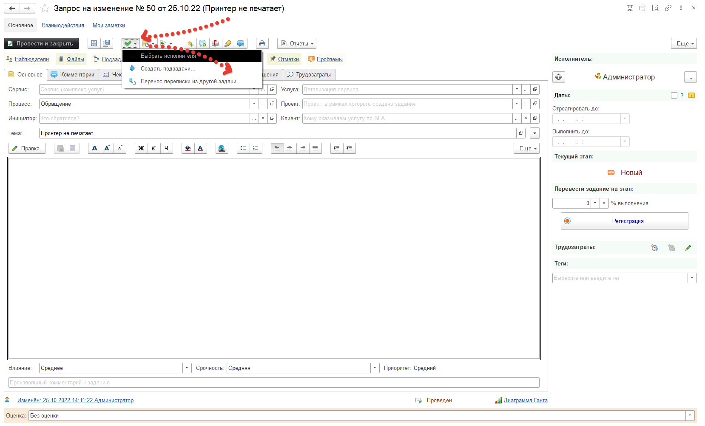
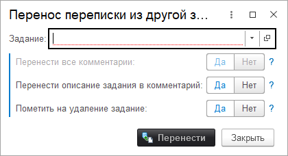

# Перенос переписки в документе "Задание"

Бывают случаи, когда становится необходимо перенести переписку из одного "Задания" в другое. Например, человек, обратившийся в техподдержку, создает одинаковые задания или пишет комментарий в новом задании и нам  их нужно объединить. В нашей конфигурации реализован подобный механизм. В этой статье предлагаю ознакомиться с ним. Для этого откроем документ "Задание", в которое мы хочем перенести переписку и нажмем в верхнем меню "Перенос переписки из другой задачи", как показано на изображении.

После этого перед нами откроется следующее окно.

В данном окне нам нужно выбрать задание из которого будет перенесена переписка, а так же определить нужно ли перенести описание в комментарий и пометить на удаление само задание.После того как мы определились с нужными нам опциями можно нажать кнопку "Перенести".

Следует обратить внимание на следующую логику при переносе переписки из другого задания. Если у заданий стоят разные инициаторы, то инициатор, из задания откуда берется переписка, становится наблюдателем в задании куда перенесена переписка. Так же при пометке на удаление задания,  и если в нем велась переписка, то дальнейшие письма больше не будут приходить в это задание, а будут создавать новое.  
  