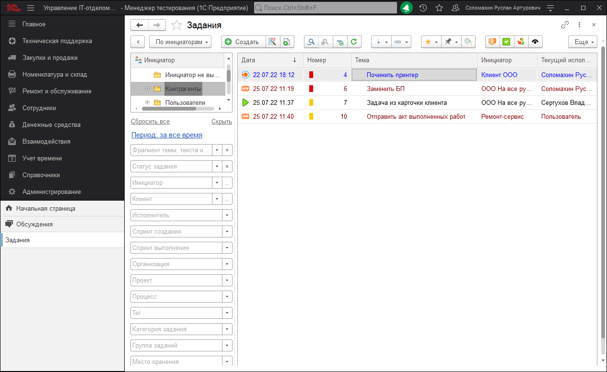

# Переписка с инициатором, или приемы техподдержки

Вы обращали внимание на то, что, когда вы обращаетесь куда-то в электронном виде за поддержкой, часто те, кто отвечают на "той" стороне стараются ответить последними. Например, вот такой вымышленный диалог:

**Вы:** У меня проблема. Такая-то, такая-то.
**Техподдержка:** Сделайте то-то и то-то и все заработает.
**Вы:** Спасибо! Получилось
**Техподдержка:** Был рад помочь.
**Вы:** А если еще возникнут вопросы, можно задавать?
**Техподдержка:** Конечно.
**Вы:** Еще раз спасибо!
**Техподдержка:**Всего доброго.

Обратите внимание - что бы Вы не писали, саппорт всегда старается ответить последним, хотя в некоторых случаях можно было бы обойтись и без этого, например, как в диалоге Выше. На самом деле это не просто так!
Это специальный прием, который позволяет техподдержке делать свое дело. Зачем это нужно и почему так работать правильно рассмотрим причины таких действий на примере нашей конфигурации:

Вот как выглядит окно с заданиями:

Пусть вас не смущает этот скриншот - это пример. Обратите внимание на столбец "Номер" в нем есть цветной индикатор.
Он означает следующее:

* **Цвет серый** - задание выполнено и завершено. Текст переписки не имеет значения в текущий момент, не обращаем на него внимания.
Цвет зеленый - в задании текущий пользователь (т.е. Вы) являетесь исполнителем и в переписке с пользователем, вы последним добавили сообщение. Т.е. мяч на той стороне и вы либо ждете ответа, либо задание закроется автоматически.
* **Цвет зеленый с белой буквой Т** - в задании текущий пользователь (т.е. Вы) НЕ являетесь исполнителем и в переписке с пользователем, ответственный сотрудник техподдержки последним добавил сообщение, т.е. ответил человек из техподдержки.
* **Цвет красный** - в задании текущий пользователь является исполнителем и в переписке инициатор последним добавил сообщение. Т.е. вам необходимо что-то сделать: помочь с ответом, вопрос не решен и требует доработки и т.д.
* **Цвет желто-оранжевый** - в задании текущий пользователь НЕ является исполнителем и в переписке инициатор последним добавил сообщение. Т.е. Вы к заданию не имеете прямого отношения, но видите, что тот, кто отвечает за него еще не ответил инициатору задания.
* **Цвет синий** - вы видите задание или являетесь наблюдателем и в нем было добавлено сообщение, но добавлено не инициатором и не текущим исполнителем.

Ну а теперь начинается магия! :)
Смотрим, на список и находим для себя КРАСНЫЕ индикаторные маркеры. Ага - это наши задачи, нам написали те, кто обратился, и мы им еще не ответили. Далее желто-оранжевые, мы там не решаем ничего, но в случае, если долго висит, может стоит поинтересоваться у коллег почему долго не закрывается задача. Синий - это не так важно, но все же. Ну и последние - зеленые - в них все отлично: мы ответственные и мы или наши коллеги отписались последними, значит все под контролем.

Такой простой прием позволяет быстро быть в курсе всего и не смотреть один и те же задачи. Более того, если настроено автозакрытие заданий, то программа увидит, что мы последние редактировали задание и, если в течении какого-то времени инициатор не ответит, значит будем считать, что задание было нами решено или выполнено. При этом программа сама все автоматически закроет.
Вот поэтому техподдержка всегда и заканчивает последней в переписке все ради этого!

Мы рекомендуем эту схемы работы, как наиболее удобную.
