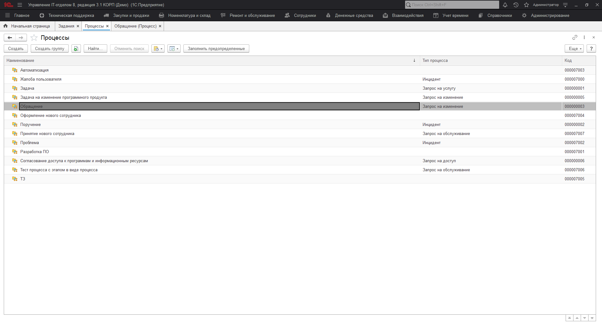
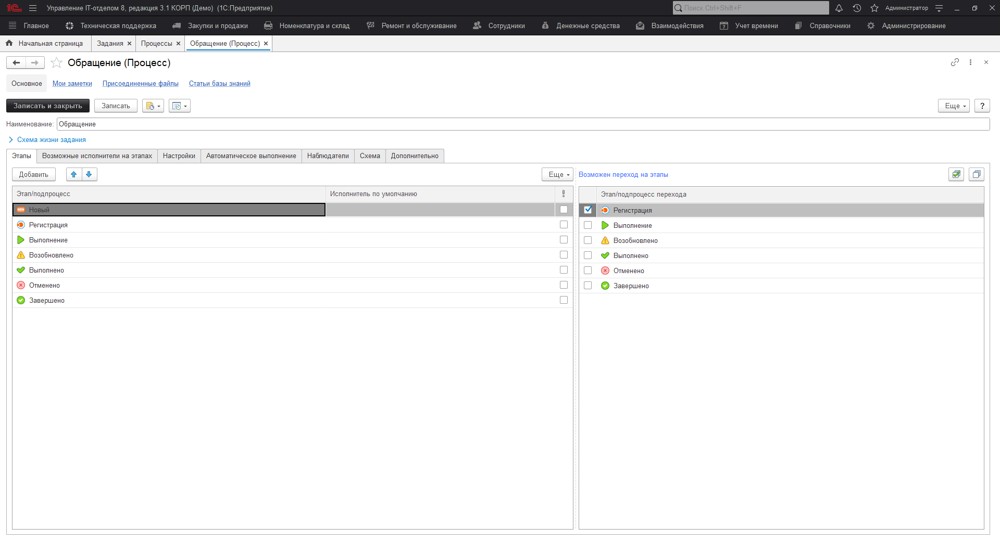
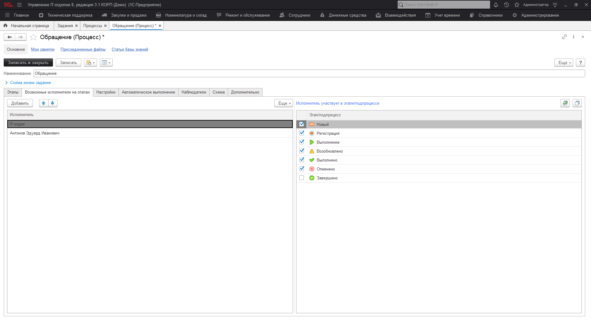
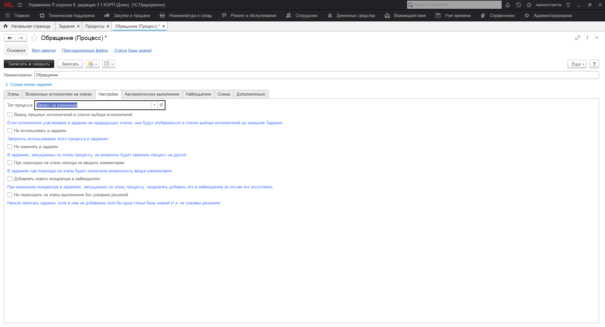
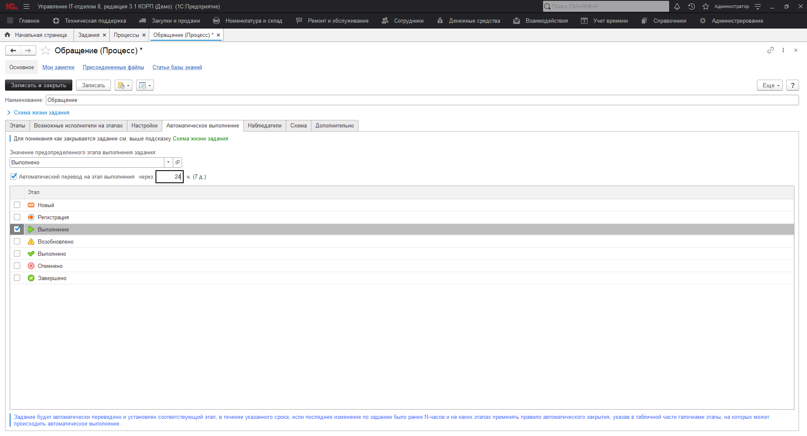
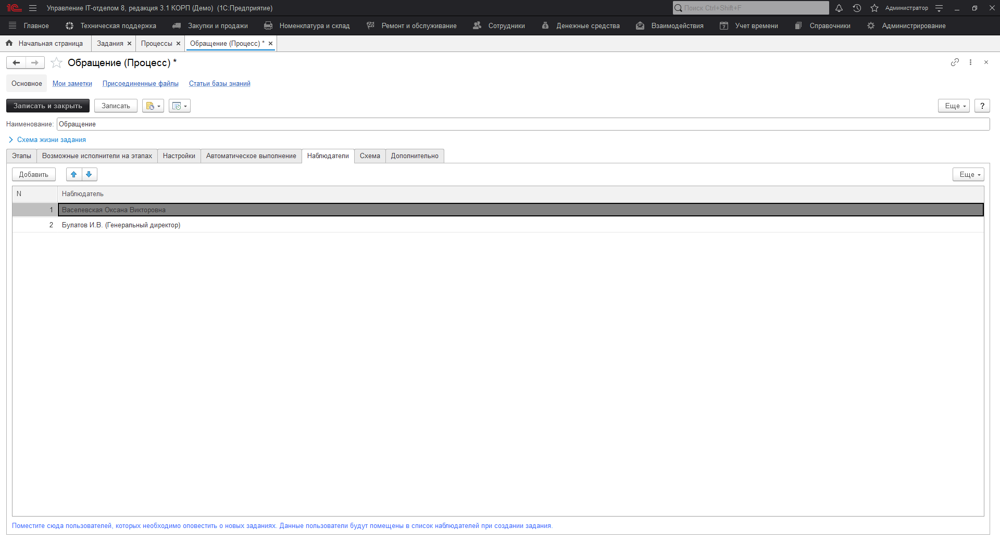

# Процессы Service Desk

Процессы являются важной составляющей ITIL и нашего решения, в котором предусмотрена подсистема ["Техническая поддержка" (Service Desk)](https://softonit.ru/FAQ/courses/?COURSE_ID=1&CHAPTER_ID=022&LESSON_PATH=1.22). При плотном использовании данного функционала, без процессов не обойтись. Поэтому разберемся, как настраивать и использовать процессы Service Desk.

Перейдем в раздел "Техническая поддержка" -> "Процессы", откроем форму списка, которая содержит предопределенные и [созданные процессы](https://softonit.ru/FAQ/courses/?COURSE_ID=1&LESSON_ID=690&LESSON_PATH=1.112.690).

Откроем форму элемента процесса и рассмотрим реквизиты, которые находятся на форме. Вверху форму располагаются следующие поля:  
* [x] **Наименование** - название процесса;  
* [x] **Вес** - вес процесса, который будет задействован в автоподсчете общего веса задания.  

Ниже располагается первая табличная часть "Этапы", содержащая этапы данного процесса. Слева располагаются этапы, которые будут задействованы в процессе. Также у каждого из этапов можно установить "Исполнителя по умолчанию", который будет автоматически становиться текущим исполнителем при переходе на данных этап. С помощью кнопки "Добавить" можно добавить новый этап, а кнопками (вверх\вниз) ранжировать их иерархию. Справа настраиваются переходы между этапами, например, осуществить переход с этапа "Новый" можно на этапы "Выполнение" и "Выполнено" (согласно настроенным переходам).

Следующая табличная часть "Возможные исполнители на этапах" содержит список исполнителей процесса, которые возможно будут являть текущими исполнителями на том или ином этапе. Это означает, что при переходе на этап, будет дана возможность выбора исполнителя из добавленных групп или пользователей в этой табличной части.

Закладка "Настройки" содержит ряд настроек процесса. Можно указать тип данного процесса, а также отметить необходимые чек-боксы для тонкой настройки.

* [x] **Вывод прошлых исполнителей в списке выбора исполнителей** - позволяет отобразить исполнителей, которые участвовали в задании на прошлых этапах;
* [x] **Не использовать в задании** - запрещает использовать этот процесс в заданиях;
* [x] **Не изменять в задании** - в заданиях, которые были созданы под этим процессом, нельзя будет установить другой процесс;
* [x] **При переходах на этапы никогда не вводить комментарии** - при переходах между этапами будет запрещено оставлять комментарии;
* [x] **Добавлять нового инициатора в наблюдатели** - при смене инициатора будет предложено добавить его в наблюдатели;
* [x] **Не переходить на этапы выполнения без указания решения** - нельзя выполнить задание, не указав решение данной задачи.

Табличная часть "Автоматическое выполнение" позволяет произвести настройку автоматического выполнения или завершения задания, у которого установлен данный этап. [Обучающее видео](https://www.youtube.com/watch?v=K5IS3nKkDws).

Табличная часть "Наблюдатели" позволяет установить список пользователей, которые будут автоматически добавлены в наблюдатели, при использовании этого процесса в заданиях.

На закладке "Схема" можно схематично отобразить, например, переходы между этапами процесса, а на закладке "Дополнительно" указать родительскую группу и добавить произвольный комментарий для справочной информации.