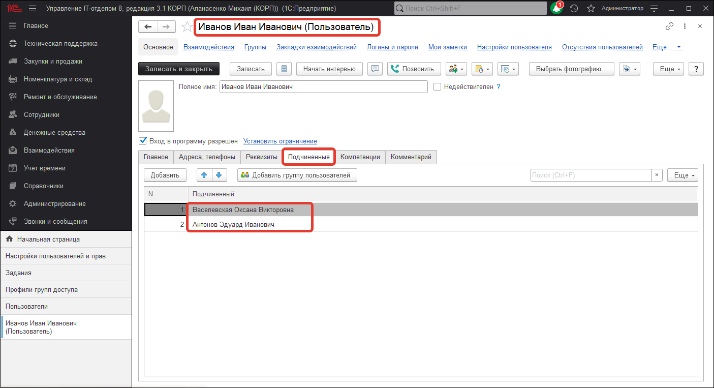

# Распределение прав доступа

Для реализации ограничения прав доступа предназначены специальные объекты конфигурации - Роли. Роль определяет, какие действия, над какими объектами метаданных может выполнять пользователь, выступающий в этой роли. В процессе ведения списка пользователей каждому пользователю ставится в соответствие одна или несколько ролей. Для ограничения доступа к данным на уровне записей и полей, существуют действия над объектами, хранящимися в базе данных (справочниками, документами и т.д.), отвечающие за чтение или изменение информации.

В подсистеме **Service Desk**, есть различные варианты работы с заданием. Для того, чтобы пользователь мог работать в упрощенной форме документа и видел только свои задачи необходимо установить следующий набор ролей:

* [x] Базовые права БСП;
* [x] Базовые права УФ;
* [x] Вывод на принтер, в файл, в буфер обмена;
* [x] Запуск веб-клиента;
* [x] Запуск толстого клиента;
* [x] Запуск тонкого клиента;
* [x] Добавление заданий;
* [x] Чтение заданий.

При таком наборе прав пользователю будет доступен минимальный функционал, который позволит только создавать новое задание.

Так видит документ задание **инициатор**.

Для того, чтобы пользователь мог выполнять задания, нужно что бы был следующий набор ролей:

* [x] Базовые права БСП;
* [x] Базовые права УФ;
* [x] Вывод на принтер, в файл, в буфер обмена;
* [x] Выполнение заданий;
* [x] Добавление заданий;
* [x] Запуск веб-клиента;
* [x] Запуск толстого клиента;
* [x] Запуск тонкого клиента;
* [x] Чтение дополнительных отчетов и обработок;
* [x] Чтение заданий.

Так видит документ задание **исполнитель**.

Для того, чтобы пользователь мог распределять задания, необходимо назначить следующие роли:

* [x] Базовые права БСП;
* [x] Базовые права УФ;
* [x] Вывод на принтер, в файл, в буфер обмена;
* [x] Выполнение заданий;
* [x] Добавление заданий;
* [x] Запуск веб-клиента;
* [x] Запуск толстого клиента;
* [x] Запуск тонкого клиента;
* [x] Просмотр не распределенных заданий;
* [x] Распределение заданий;
* [x] Чтение дополнительных отчетов и обработок;
* [x] Чтение заданий.
В этом случае пользователь сможет распределять задания между исполнителями.

Следует учесть, что после того, как исполнитель будет назначен и текущий пользователь не будет этим исполнителем, задание пропадет из формы списка. Связано это с тем, что у пользователя недостаточно прав на просмотр чужих заданий.
Очень часто, необходимо распределять задания между подчиненными и при этом видеть его задание в списке. Для этого есть два способа:

1. Пользователю можно добавить подчиненного или группу подчиненных;

В этом случае пользователю будут видны задания подчиненных.

2. Добавить пользователю роль "Просмотр чужих заданий". Список ролей:

* [x] Базовые права БСП;
* [x] Базовые права УФ;
* [x] Вывод на принтер, в файл, в буфер обмена;
* [x] Выполнение заданий;
* [x] Добавление заданий;
* [x] Запуск веб-клиента;
* [x] Запуск толстого клиента;
* [x] Запуск тонкого клиента;
* [x] Просмотр не распределенных заданий;
* [x] Просмотр чужих заданий;
* [x] Распределение заданий;
* [x] Чтение дополнительных отчетов и обработок;
* [x] Чтение заданий.

В этом случае, в форме списка будут отображаться и чужие задания.

Для наблюдателей можно установить следующие роли:

* [x] Базовые права БСП;
* [x] Базовые права УФ;
* [x] Вывод на принтер, в файл, в буфер обмена;
* [x] Запуск веб-клиента;
* [x] Запуск толстого клиента;
* [x] Запуск тонкого клиента;
* [x] Чтение заданий.
 
Форма документа задание наблюдателя.

Каждому пользователю может быть назначены роли, которые в совокупности образуют его персональные настройки прав доступа. Они могут быть как для чтения, так и для редактирования.
