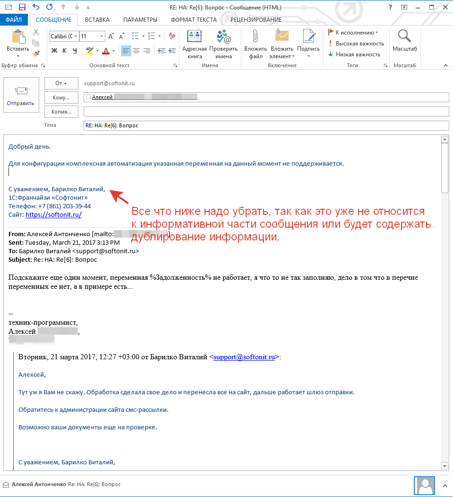

# Маркеры выполнения, установки срока и окончания электронных писем

При создании заданий и сообщений в заданиях можно использовать маркеры в письмах.
Маркеры - это контрольные словосочетания, которые позволяют совершать в заданиях какие-то действия.
Рассмотрим разные типы маркеров, которые поддерживаются системой:

## Маркеры выполнения задания

Часто бывают ситуации, когда нет доступа к рабочей базе, или не удобно прям сейчас взять и открыть задание в 1С и выполнить его. На этот случай мы реализовали возможность выполнения задания из электронного письма. Отправляем письмо на ящик службы поддержки со специальным текстом и задание закрывается. Вот список маркеров:

// Русские словосочетания маркеры
* Закрыть задание.
* Закрыть задачу.
* Задачу выполнил.
* Задачу выполнила.
* Задачу решил.
* Задачу решила.
* Задача решена.
* Задание закрыто.

// Английские словосочетания маркеры.
* Close task.

Если в тексте письма, которое будет отправлено на ящик службы поддержки будут встречены эти словосочетания-маркеры, то задание будет закрыто.  

!!!
Важно! Обратите внимание, маркеры будут работать только в том, случае, если вы в настройках параметра учета включите галочку "Использование выполнение задания по текстовым фразам в сообщениях".
!!!

*(Администрирование -> Настройки параметров учета -> Service Desk -> Электронная почта -> Маркеры)*
Для срабатывания маркеров выполнения в процессе должен быть установлен этап
(Техническая поддержка -> Процессы -> [процесс] ->Автоматическое выполнение -> Значение предопределенного этапа выполнения задания )

## Маркеры установки срока
Аналогично, если мы хотим установить/изменить срок выполнения (крайнюю дату) задания.

* // Русские словосочетания маркеры.
* Срок [%г]
* Срок [%г.]
* Срок [%года]
* Срок [% г]
* Срок [% г.]
* Срок [% года]
* Срок [%]
* Срок (%г)
* Срок (%г.)
* Срок (%года)
* Срок (% г)
* Срок (% г.)
* Срок (% года)
* Срок (%)
* Срок {%г}
* Срок {%г.}
* Срок {%года}
* Срок {% г}
* Срок {% г.}
* Срок 
* Срок - %г.
* Срок - %года.
* Срок - % г.
* Срок - % года.
* Срок до %г
* Срок до % г
* Срок до % года

где символ "%" - это маска даты. Может быть передана как конкретная дата или дата с временем, так и вычисляемая дата, например, "Срок [+5 дней]", или "Срок (+5 часов)", или "Срок (+1 нед.)", так же поддерживаются и общепринятые сокращения "ч." (часов), "д." (дней), "н." (недель), "м." (месяцев).

Если же в задании был заполнен реквизит "Выполнить до" (желаемая дата выполнения) датой 25.03.17 12:00:00, а мы (или инициатор) написали письмо следующего содержания "Увеличить время выполнения и установить срок **(+5 дней)** от текущего времени" (маркер выделен). То в задании автоматически произойдет изменение даты с 25.03.17 12:00:00 >> 30.03.17 12:00:00.

Эта возможность позволит управлять реквизитом "Выполнить до" в задании не открывая задания. С исполнителем аналогично, если в начале, когда задание было поставлено дата не была установлена, а потом инициатор пишет, "Прошу выполнить задание в срок до **30.03.17г.**". То система поймет, что инициатор указал дату.
Маркеры окончания электронного письма
Часто так бывает, что переписка по заданию тянет за собой тонну лишнего. Приведем пример, на примере Outlook, мы получаем письмо оповещение об изменении и отвечаем на него, что мы видим:

## Маркеры окончания электронного письма

Часто так бывает, что переписка по заданию тянет за собой тонну лишнего. Приведем пример, на примере Outlook, мы получаем письмо оповещение об изменении и отвечаем на него, что мы видим:

Это образец того, как многокилометровая переписка идет в след за одни предложением, что уже само по себе не очень хорошо и в конфигурацию будет загружено в переписку.
Приведем пример маркеров окончания электронного письма:

// Русские словосочетания маркеры конца текста письма.
* С уважением

// Английские словосочетания маркеры конца текста письма.
* Best regards
* Best wishes
* Yours truly
* Truly yours
* Yours very truly
* Very truly yours
* Faithfully yours
* Kind regards

Если мы встречаем эти маркеры в письме, то считаем, что все что ниже - это старая переписка или лишний текст, не относящийся к сути переписки.
Действительно, почти все сотрудники заканчивают тексты писем именно такими словосочетаниями.

В результате, в задание попадет текст с сутью сообщения и без переписки.
