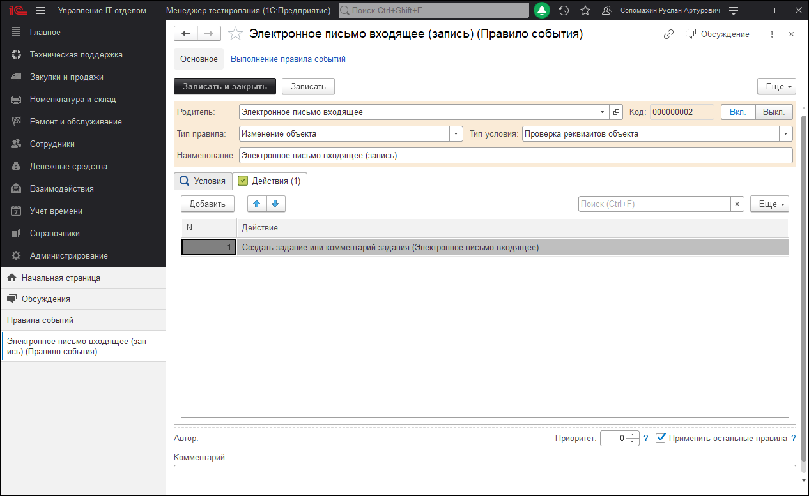

# Создание заданий из электронных писем
В конфигурации есть механизм, который позволяет из писем, которые приходят в IT-отдел создавать задания. Тема письма копируется в тему задания, текст письма – в подробное описание задания. Автоматически проставляется Инициаторы заданий, и добавляются в наблюдатели. Найти функционал можно в разделе **"Справочники" - "Правила событий"**.
Для этого необходимо проверить правило событий "Электронное письмо входящее (запись)", оно должно быть включено.

Действия правила событий.

В настройках действия правила события "Создать задание или комментарий задания (Электронное письмо входящее)" заполнить реквизиты.

!!!
Важно! Обратите внимание, что в «Дополнительные настройки сервера почты» есть флаг, который отвечает за хранение писем в почтовом ящике. Т.е. по умолчанию письма после получения удаляются.
!!!

Следует учесть, что задания создаются непосредственно из писем на почтовом сервере, они не загружаются в конфигурацию.
Чтобы настроить автоматическое создание заданий из электронных писем см. тему [«Настройка и запуск автоматического создания заданий и рассылки оповещений по заданиям»](https://softonit.ru/FAQ/courses/?COURSE_ID=1&LESSON_ID=623&LESSON_PATH=1.22.25.623).

На первой вкладке вносятся значения, которые могут подставляться автоматически при создании заданий из писем.
На вкладке "Инициаторы" устанавливается приоритет поиска клиентов и инициаторов клиентов при записи входящего письма.
На последней вкладке можно на языке 1С создать код, который позволит произвольно заполнять или не заполнять/не создавать задание из писем.

Важной особенностью программы является то, что создание заданий очень функционально и позволяет "видеть" не только новые задания и создавать их из писем, но и **переписку по уже существующему заданию.** Пример, пользователь-инициатор получает письмо о том, что его задание создано и обрабатывается, инициатор вспоминает, что он забыл что-то написать в задании IT-отделу и пишет это, что-то отвечая на письмо, которое пришло. Как вы понимаете, программа должна правильно определить, что это не новая задача и дописка к уже существующей. Тут радостная новость для всех :) Программа это умеет.
Для того, чтобы письмо было добавлено в переписку по уже существующему заданию, необходимо соблюдение ряда условий, что бы программа "поняла", что необходимо добавить сообщение в переписку, а не создавать новое задание:

* В теме письма-ответа был текст: RE: или HA: (в англ или русской раскладке);
* Присутствовал один из маркеров указанный в теме письма (например ID#);
**После** текста маркера был найден номер (например ID#256 или ID#00000000256). Маркеры вы можете найти на закладке Маркеры в обработке *Настроек параметров учета > Администрирование*.
* Задание-основание было найдено по номеру либо сокращенному без нулей, либо по полному.
* Задание-основание не было завершено.
* 
Пример правильной темы: *RE: ID#256 Не работает принтер.*
Т.е. пользователь получил письмо с темой ID#256 Не работает принтер, при ответе на него тема стала RE: ID#256 Не работает принтер и отправил его. Программа, проверив тему убедилась, что это письмо ответ, по уже существующему и добавила его в переписку по заданию.
Получается очень удобна схема взаимодействия.

