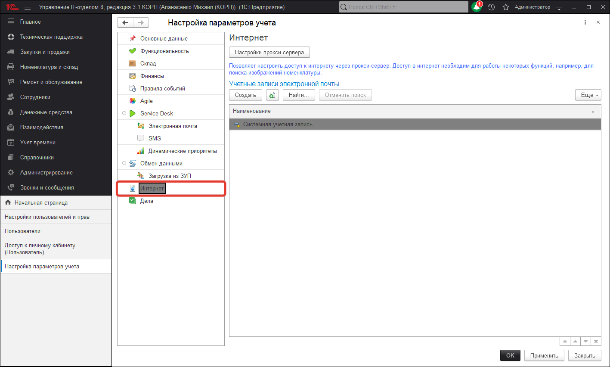
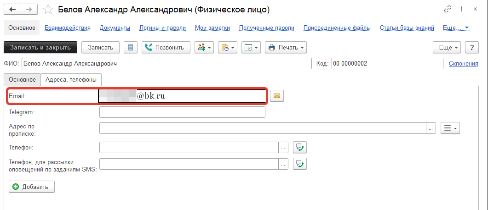
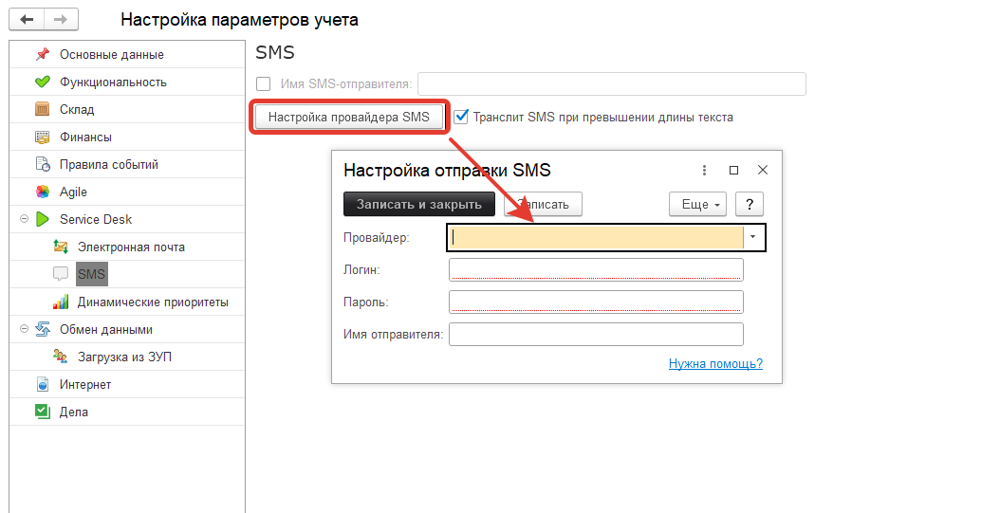
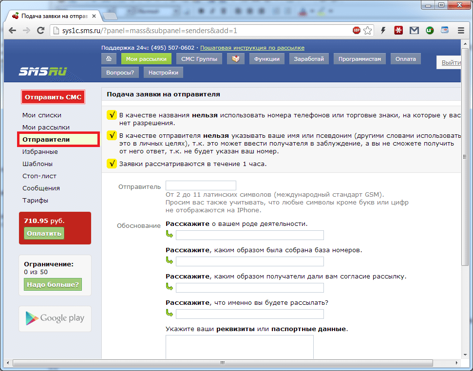
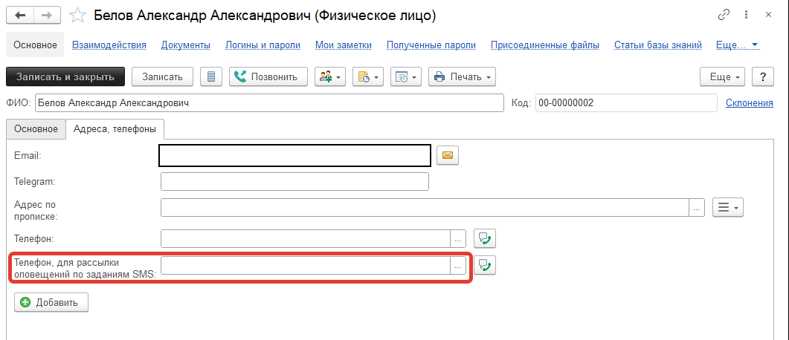

# Уведомление пользователя об изменении задания по почте\смс

!!!
Для того, чтобы пользователь получал уведомление по электронной почте об изменении задания, в котором он участвует, необходимо:
!!!

1. Настроить параметры доступа к почтовому серверу, а также параметрам писем с оповещением *(Администрирование > Настройка параметров учета > Интернет )*.

2. Настроить для каждого пользователя e-mail куда будут отправляться оповещения *(Справочники > Физические лица)*

3. Настроить выполнение регламентных заданий для рассылки оповещений в автоматическом режиме (см. [ссылку](https://softonit.ru/FAQ/courses/?COURSE_ID=1&LESSON_ID=623&LESSON_PATH=1.22.25.623) ), либо после каждого изменения задания нажимать на закладке «Выполнение» кнопку «Отправить оповещения».

!!!
Для того, чтобы пользователь получал уведомление об изменении задания, в котором он участвует по SMS, необходимо:
!!!

1) Настроить параметры доступа к SMS-шлюзу, а также параметрам писем с оповещением (закладки Оповещение, По SMS) на вкладке Администрирование > Настройка параметров учета.

2) Нажмите Настройка провайдера SMS и укажите логин и пароль для авторизации на SMS-шлюзе.

3) Измените формулу оповещения по SMS. Учтите, что длинна текста одного SMS на русском языке достигает 67 символов. Имя SMS-отправителя нужно указать только после того, как оно будет согласовано с SMS-шлюзом (зайдите на сайт SMS-шлюза и укажите какое имя вы хотите использовать и как получили:

Пример для сайта [sms.ru](https://sys1c.sms.ru/) . Как только Вы согласуете отправителя его можно использовать в нашей конфигурации в соответствующем поле. Если отправлять СМС без поля отправитель, то СМС будут приходить от номера, на котором зарегистрирована учетная запись.

4) После настройки параметров SMS-шлюза перейдем к настройке оповещений для пользователя.

СМС-сообщения будут приходить пользователям на номер, который будет указан в настройках элементов справочника "Пользователи".

В частности, поле "Телефон, для рассылки оповещений по заданиям SMS". Заполните его для каждого пользователя, который будет получать SMS.

5) Добавить пользователя в Наблюдатели задания. Для этого открыть задание, нажать «Наблюдатели» и добавить туда пользователя и способ оповещения "SMS".

6) Настроить выполнение регламентных заданий для рассылки оповещений в автоматическом режиме (см. ссылку ), либо после каждого изменения задания нажимать на закладке «Выполнение» кнопку «Отправить оповещения».

