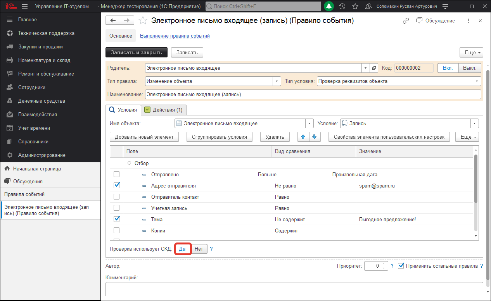

# Фильтр игнорирования автоответов при создании комментарием или заданий

Давайте рассмотрим на примере вопроса:

> ***Столкнулись с такой проблемой, что при закрытии обращения инициатору отправляется письмо с информацией, что его обращение закрыто. У клиента стоит на почтовом ящике автоматический ответ "Письмо получено". В данном случае происходит автоматическое открытие задачи снова и так до бесконечности. Как установить фильтр, чтобы такие письма игнорировались?***

В программе задания, которые получены через электронную почту создаются путем срабатывания регламентного задания "Получение и отправка электронных писем" и отработки правила события "Электронное письмо входящее (запись)". Благодаря такому подходу задания, полученные через почту, создаются в несколько раз быстрее, чем это происходило ранее. А для того, чтобы задания не создавались на основе автоматических писем, необходимо настроить правило событий.  
Например, указать какие-либо признаки в условиях отбора правила событий, т.е. если отправитель такой-то и тема такая-то, тогда по этим признакам новое задание не будет создано. 

