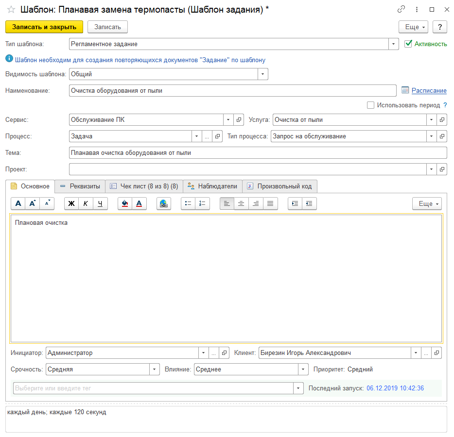

# Создание повторяющихся/периодических заданий по расписанию

В работе бывает необходимо создавать периодические инциденты. Примеров на эту тему можно привести много.

* Проверка создания бэкапов
* Ежемесячное создание планов закупки, бюджетов
* Регламентная "чистка" системных блоков от пыли
* ...
И их можно приводить и приводить. Т.к. мы часто делаем однотипные дела с заданным интервалом.

В нашем решении есть возможность учитывать такие задачи. Т.е. завести шаблон регламентной задачи, заполнить основными реквизитами, указать расписание создания и на выходе получим задачи, которые создаются автоматически!

Итак, открываем справочник "Шаблоны заданий" и создаем новый элемент с указанием типа шаблона "Регламентное задание":

Здесь можно заполнить основные реквизиты заданий, которые будут созданы, а также расписание создания, списка наблюдателей, чек-листа и т.д. Они будут установлены при создании нового задания из шаблона.

При этом автоматически созданные задания будут так же, как и обычно созданные, рассылать уведомления исполнителю, наблюдателю и инициатору.

Тут же можно увидеть, когда последний раз запускалось автоматическое создание заданий для данного шаблона.

Галочка ***"Активность"*** позволяет включить, или выключить создание по этому шаблону. Если галочка снята, то создание заданий по данному шаблону производиться не будет.

Реквизит "Видимость шаблона" имеет три положения:

* [x] **Общий** - будет виден всем пользователям;
* [x] **Личный** - доступен только пользователю, который создал шаблон;
* [x] **Группы пользователей** - доступен для выбранной группы пользователей.
Проверка на необходимость создания заданий по шаблону и соответствия расписанию выполняется по умолчанию каждую минуту и если проверка показывает, что настало время создания согласно расписанию, то происходит создание по шаблону. Так же эту проверку можно запустить самостоятельно вручную из списка заданий.

Создание заданий на основании этих шаблонов происходит с помощью соответствующего регламентного задания "Автоматическое создание регламентных заданий по шаблонам".

!!!
Внимание! Если по какой-то причине регламентное задание не работает и не создает задания на основании шаблонов, то необходимо проверить расписание регламентного задания по ссылке выше. Иногда на файловых базах бывает проблема, когда регламентное не выполняется, помогает простое открытие регламентного задания изменение пары реквизитов и его запись.
!!!