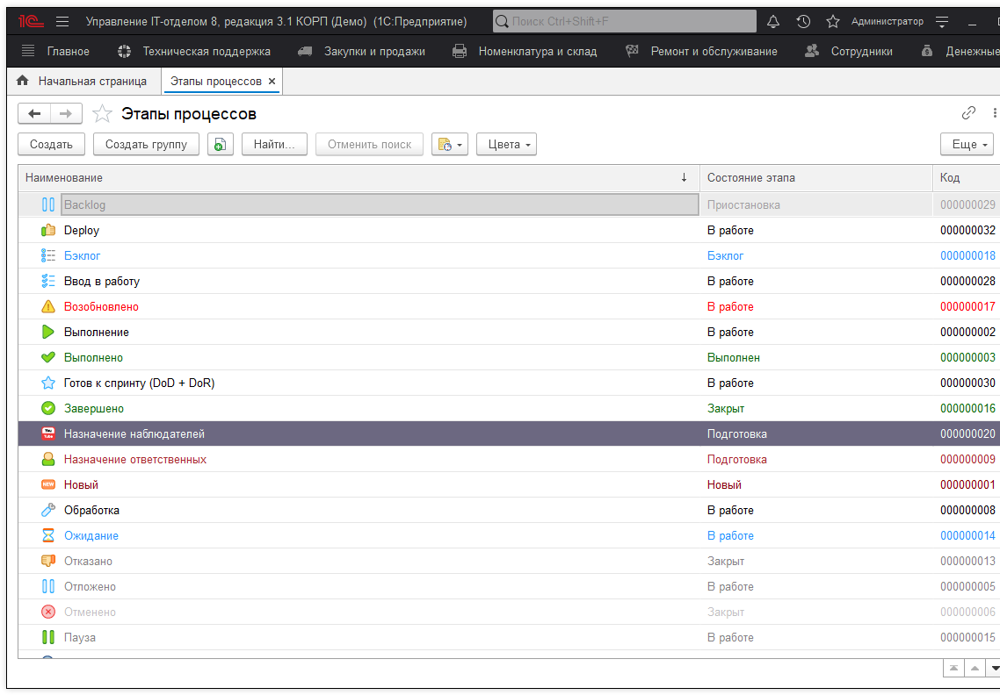
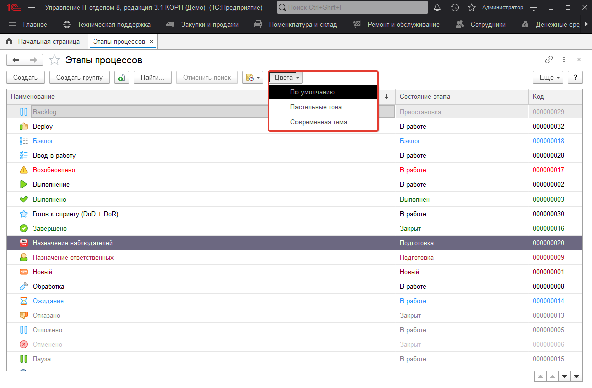
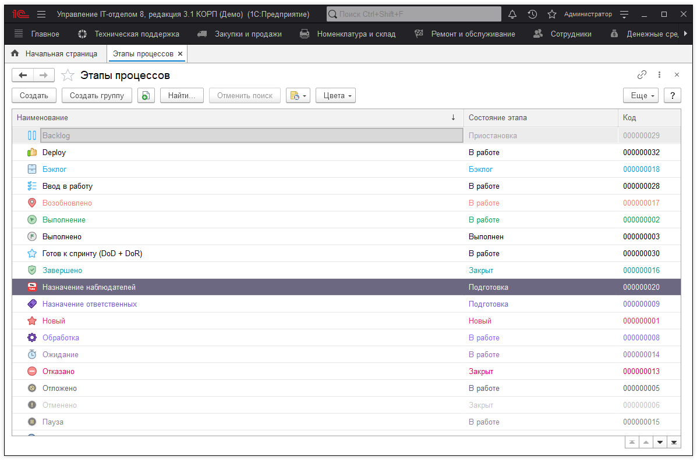
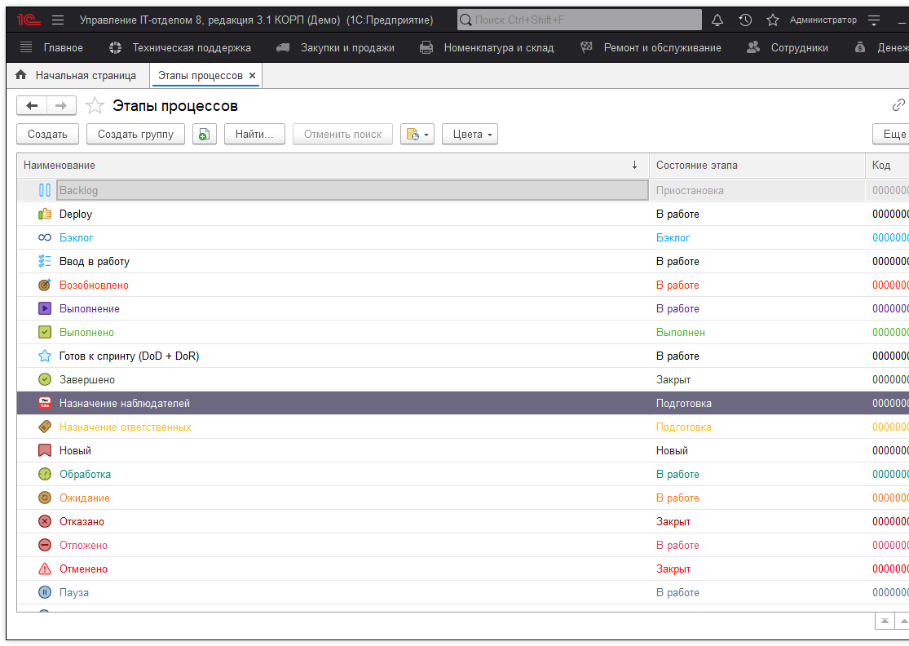
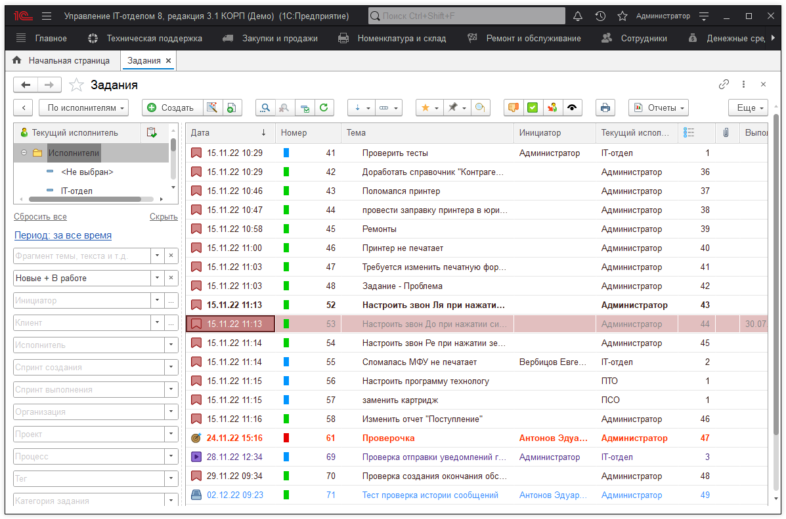

# Цветовое оформление этапов процесса
Пользователи конфигурации "Управление IT-отделом 8" зачастую в большей мере используют программу, как Service Desk систему. Что подразумевает собой список, поступивших обращений, которые должны быть отработаны в соответствии со сроками SLA. В связи с этим сотрудникам технической поддержки приходится постоянно просматривать этот список. Каждая задача из списка в тот или иной момент может находится на определенном этапе. Для более удобного восприятия, этапы разделены цветовым оформлением. Это позволяет быстро определить на каком этапе находится задание на текущий момент. Однако стандартное цветовое оформление может одним быть по душе, а другим "резать" глаза. Поэтому мы приняли решения добавить две новых темы оформления для этапов процесса, при этом стандартная тема не удалена. Для того чтобы сменить оформление процессов, перейдем в раздел "Справочники" - "Этапы процессов". 

На изображении выше видно, как выглядит стандартная тема оформления этапов. Теперь, чтобы изменить тему необходимо на панели команд нажать кнопку "Цвета" и выпадающем списке выбрать необходимый вариант оформления.

Выбрав вариант пастельной темы получим цветовое оформление этапов следующего вида:

Если выберем современную тему, то тогда этапы окрасятся в цветовую гамму следующего вида:

Таким образом, появилась возможность варьировать оформлением формы списка заданий.

