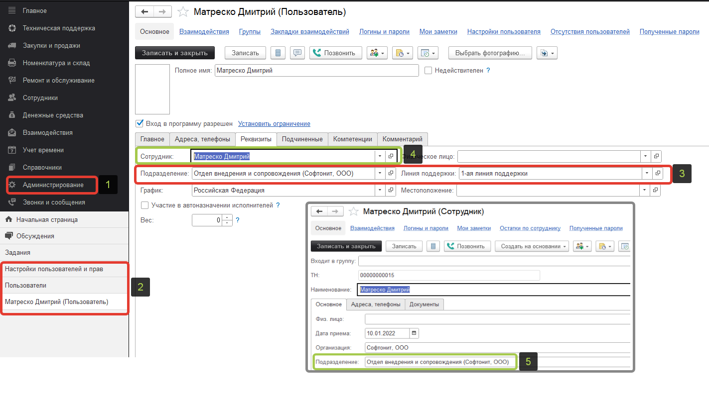

# Эскалация задания

## Что такое «Эскалация»?

**В нашем решении есть ряд способов передачи задачи на другого исполнителя:**

1) Вручную - выбрать из справочника пользователей необходимого
2) Автоматически через правила событий - настроить логику передачи задачи на основании выполнения определенных условий
3) **Эскалация** -деятельность, которая позволяет своевременно разрешить инцидент с помощью дополнительных знаний (функциональная эскалация) или дополнительных полномочий (иерархическая эскалация), чтобы выполнить инцидент в срок, который указан в SLA.

* Другими словами под эскалацией можно понимать передачу задачи исполнителю, обладающему соответствующей компетенцией, необходимой для решения задачи.
Например: специалист первой линии поддержки не смог самостоятельно решить вопрос, для выполнения заявки - он передает задачу на специалиста второй линии.

## Как настроить механизм эскалации в «Управление IT-отделом 8»

Указываем у пользователя линию поддержки(это самый обязательный параметр для процесса эскалации) и подразделение (шаг 1-3)
Создаем сотрудника для этого пользователя (далее это будет необходимо для группировки по подразделениям в окне выбора исполнителя) (шаг 4) и указываем подразделение у сотрудника (шаг 5)Заполнение реквизитов

Подразделение сотрудника указывается  -  с целью дальнейшей визуальной группировки в форме выбора исполнителя в документе «Задание» (рис.ниже)
* *Это необязательный пункт - исполнитель может находиться и вне группировки, но при этом участвовать в процессе эскалации, т.к. у него будет указана линия поддержки.*

3. Следующим обязательным шагом будет - добавление  пользователей возможными исполнителями в рамках процесса поддержи и указание этапов, в которых может участвовать исполнитель.

* *Без добавления пользователей во вкладку «Возможные исполнители на этапах» мы не сможем выбирать необходимых нам исполнителей в рамках текущего процесса.
Например: указать, что на этапе «Новый» можно выбирать лишь пользователей с первой линии, соответственно, пользователей второй мы видеть не будем. А вот для этапа «Выполнение» указать, что исполнителем может быть группа пользователей со второй линии.*

* *Можем указать как отдельного пользователя, так  и отдельную группу пользователей, сгруппированных по определенному признаку - например по линии поддержки. 
Ваши группы пользователей могут называться как угодно, т.к. этот этап(указания исполнителей процесса) необходим лишь для доступности указанных исполнителей в форме выбора исполнителя.  Группировка пользователей зависит только от указанного подразделения их объекта «Сотрудник».*

## Применение

1. Важное примечание: механизм эскалации показывает доступных вышестоящих исполнителей, отталкиваясь от текущего пользователя конфигурации и его линии поддержки. Именно текущего пользователя - который открыл форму выбора исполнителя и хочет эскалировать задачу. Но не текущего исполнителя, который уже может быть указан у задачи.

*То есть: если пользователь, нажавший кнопку «Эскалация», относится к  пользователям первой линии - он увидит все вышестоящие линии поддержки и их участников. Если же пользователь относится ко второй линии поддержки он увидит возможных исполнителей лишь вышестоящих линий поддержки: 3-йя линия поддержки и 4-ая линия поддержки. Соответственно - для пользователя с 3-ей линии поддержки будут доступны исполнители с 4-ой линии поддержки.*

2. После заполнения вкладки «возможные исполнители на этапах»,  в форме выбора исполнителя документа «Задание» перед нами предстаёт список из всех доступных для выбора исполнителей. Независимо от линии поддержки нам доступны все пользователи, которых мы указали ранее для этапа «Новый» .

3. Если всё правильно сделано на предыдущих этапах - при нажатии кнопки «Эскалация»  будет произведен отбор и станут доступны исполнители с вышестоящих линий поддержки.

