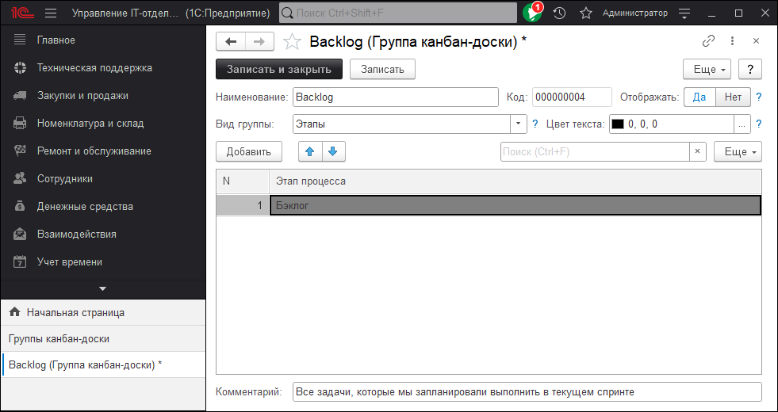
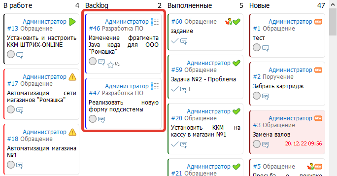
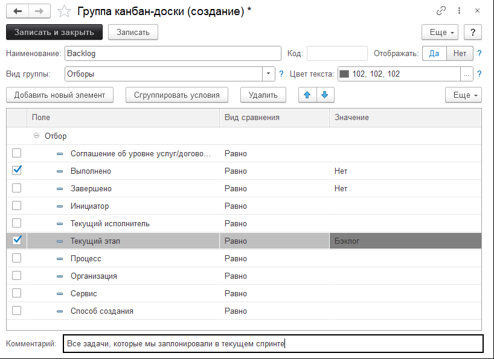

# Добавляем настраиваемые группы (столбики) на канбан-доске

У пользователей есть возможность переопределить группы (столбики) в канбан-доске.
Иногда это необходимо для выполнения разных вещей, которые могут в той или иной степени сделать использование нашей конфигурации более интересной.
Например, сделать отдельную доску для публикации статей в базу знаний.
А там группы будут, например: Запланированы, В работе, Вычитка, Выполнено.

Есть несколько вариантов отборов в каждом из столбце и при настройке это надо учесть:

## Вариант №1. Использовать список этапов в отборах

В этом случае в столбец попадут этапы по заданиям, которые указаны в табличной части.
Пример:

Т.е. в этот столбик попадут все задачи, которые находятся на этапе **Бэклог** и будет все это выглядеть вот так:

## Вариант №2. Использовать запрос в отборах.

В этом случае в столбец попадут те данные, которые будут указаны по заданиям, которые указаны в табличной части.
Пример настройки:

Это более сложный вариант настройки, но с помощью него можно добавиться более гибких отборов. Например, отобрать дополнительно по инициатору или процессу. Этот вариант более сложный, но "умеет" больше, чем первый.

!!!
**Важно! Вид группы "Отборы" работает медленнее , чем "Этапы". Учитывайте эту особенность при работе и если вы можете сделать группу через Этапы сделайте это.**
!!!

### [Видеоинструкция](https://youtu.be/4y9E4W8NEG8)