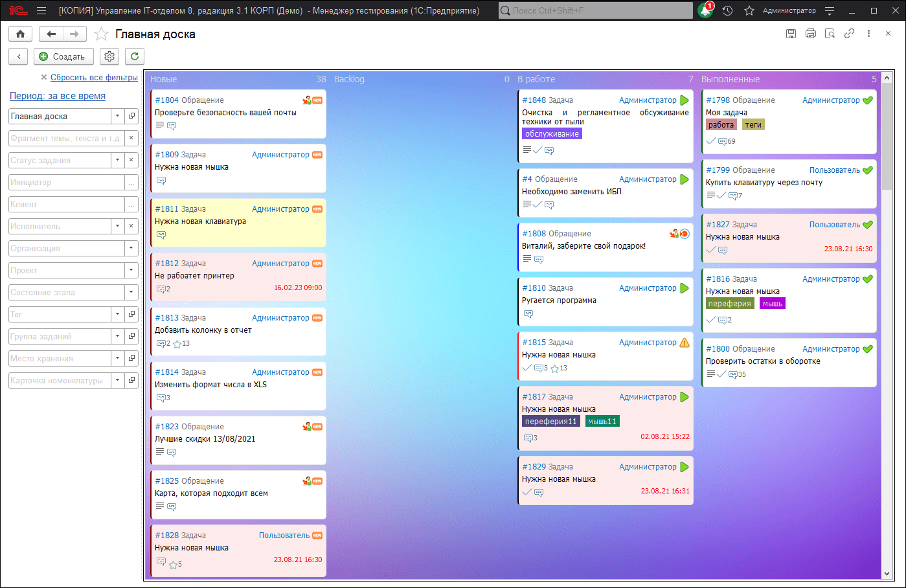

# Использование Канбан (Kanban) и Скрам (Scrum) в конфигурации

[Канбан-доска](https://ru.wikipedia.org/wiki/Канбан-доска) - это один из вспомогательных инструментов, который используется при управлении разработкой. Подобные доски рассматриваются как вариация на тему традиционных канбан-карточек. Конфигурация имеет такой функционал, пример, как это выглядит в нашем решении.

**Cписок ролей для работы с подсистемой "Канбан-доска".**
* [x] Добавление и изменение спринтов.
