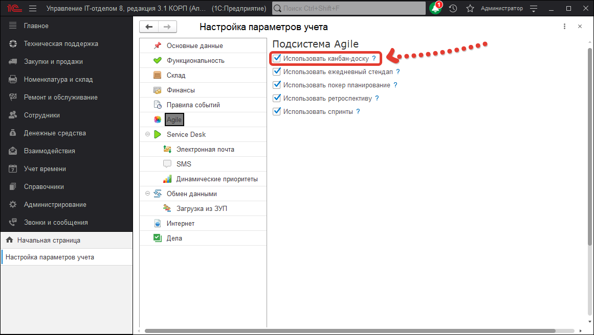

# Как использовать Канбан?
Прежде всего необходимо включить его в настройках.
*Идем в Администрирование > Настройки параметров учета > Agile.*
Там нажимаем галочку "Использовать канбан" и жмем кнопку "Применить".

После этого будут включены настройки по использованию Канбан-доски.

В частности:
* Появится справочник в НСИ: *Справочники > Service Desk > Группы канбан-доски*.
* В подсистеме Техподдержка появится пункт Канбан со спринтами.
* В форме документа "Задание" появится реквизит "Спринт".
* В форме списка документа "Задание" появится вкладка представления заданий в виде Канбан-доски.
* 
Отредактируем список групп канбан-доски. Т.е. группы, которые выводятся на самой доске.

Принцип вывода на доске, следующий: группы канбан-доски, содержат список этапов процессов. Каждая задача в определенный момент времени находится на каком-то этапе и соответственно попадает в какую-то из колонок канбан-доски.  
Сама группа может как выводиться, так и не выводиться (кнопки поля "Отображать"), так же можно выводить не все задачи, а только их некоторое количество.   
При этом должна быть включена галочка "Использовать лимит задач и выводить первые **N** задач". Порядок отвечает за приоритет вывода групп (от меньшей к большей).  
После настройки групп, можно переходить к работе с доской.