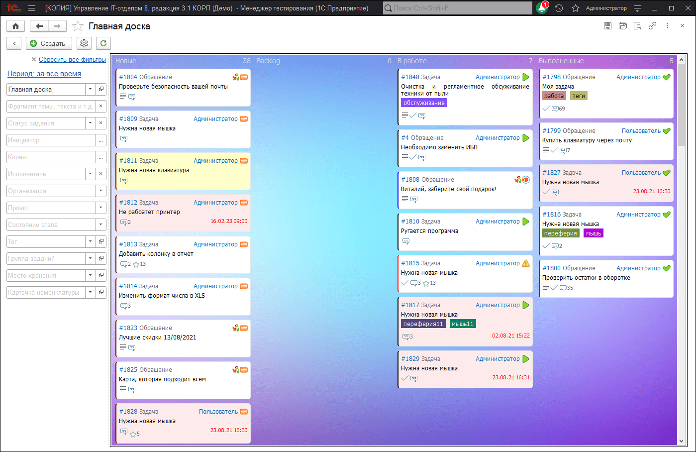

# Работа с канбан-доской

## Внешний вид

Канбан-доска выглядит вот так:

Доска разбита на несколько групп (столбиков) в каждой из которой отображается ее название и количество заданий в группе. Если использован лимит вывода, то отображается только первые задачи, а рядом общее количество. Каждый столбик-группу можно настроить и определить [что туда выводить](https://softonit.ru/FAQ/courses/?COURSE_ID=1&LESSON_ID=714).

Каждая карточка - это отдельная задача на доске. Они упорядочены в последовательности, которая указана в настройках конкретного столбца. Там можно задать сортировку.

## Содержимое карточек канбан-доски

Сама карточка задания содержит следующие реквизиты:

* Отметка задания (если есть)/ Спец значок, который может быть выведен в задании. На рисунке в группе "Новые" четвертый сверху.
* Номер задачи (кликабелен) и позволяет открыть документ "Задание".
* Наименование процесса.
* Текущий инициатор или признак отсутствия инициатора (кликабелен). При нажатии можно выбрать инициатора.
* Изображение текущего этапа (картинка) (кликабелен). При нажатии можно перевести на следующий этап и соответственно задание может "переехать" в другую группу на канбан-доске.
* Далее, тема задания. Выводится в полном виде.
* Внизу значки включен/не включен в текущий спринт, по которому можно щелкнуть и поменять прямо из доски. Если активных спринтов несколько будет предложено выбрать, если же активный всего один, то задание будет включено без вопросов.
* Если у задания есть описание, то появляется иконка с текстом. При наведении отображается описание в текстовом виде.
* Признак вложенных файлов. Есть ли в задании вложения.
* Если в задании прогресс задания изменен и отличен от нуля, то здесь будет отражен процент решения задания.
* Если в задании была переписка, то будет отражен значок чата и указано количество сообщений в чате.
* Если задана "Крайняя дата завершения задачи", то она отобразиться в правом нижнем углу.
* Слева, у карточки задания отображена полоска шириной в 2 пикселя. Ее цветом можно управлять. Для этого необходимо открыть этап процесса и в нем указать цвет рамки канбан-доски.

Так же задания в таком виде отображают просроченные (цветом, заданным в настройках) и подсвеченные задачи (цветом, заданным в настройках). Еще стоит сказать, что панель отборов, так же работает и в форме канбан-доски. Можно сделать отбор, например, по текущему спринту, или исполнителю, а так же используя комбинацию отборов.

Обратите внимание, что подсистема по умолчанию заполняет группы канбан-доски таким образом, что отображаются выполненные задания (когда исполнитель выполнил задание с его точки зрения, но инициатор еще их не принял), а завершенные не отображаются (когда в выполненных заданиях в течении какого-то времени не было изменений), их можно включить в группах канбан-доски.

## Как обновляется канбан-доска?

**Доска обновляется в фоновом режиме** (не блокируя интерфейс) в следующих случаях:

* Если текущий пользователь изменил какое-то задание
* Если изменены настройки отображения канбан-доски (запись групп канбан-доски или настроек самой доски)
* Если прошло заданное в настройках число секунд. Нажав на шестеренку на канбан-доске, можно переопределить период авто-обновления. По умолчанию, это 3 минуты. Минимальный период автообновления 15 секунд.
Так же при нажатии на кнопку "Обновление", доску можно перерисовать в любой момент в ручную.

