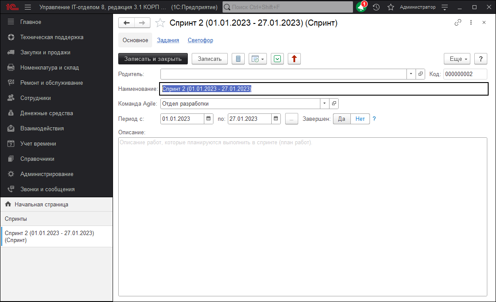
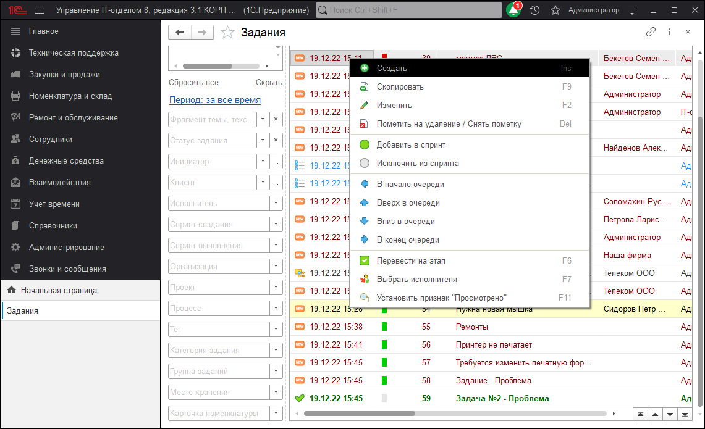
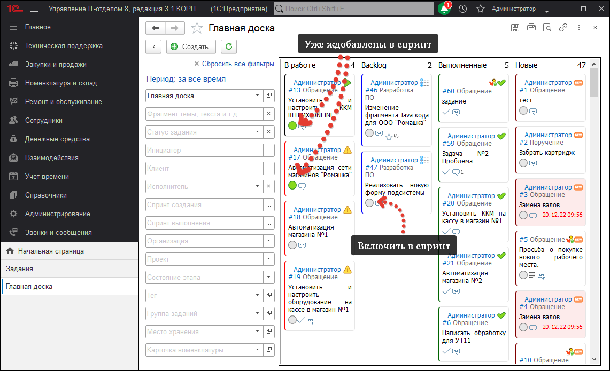
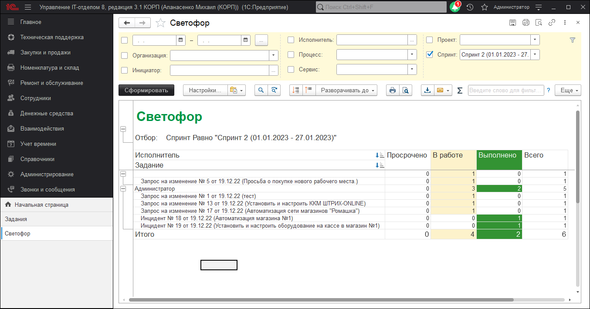

# Создание спринта, добавление заданий в спринт, отчеты по спринтам

Напомним, что же такое спринт:

!!!
**Спринт** — итерация, в ходе которой создаётся функциональный рост программного обеспечения. Жёстко фиксирован по времени. Длительность одного спринта от 2 до 4 недель. В отдельных случаях, к примеру согласно скрам-стандарту компании Nokia, длительность спринта должна быть не более 6 недель. Тем не менее, считается, что чем короче спринт, тем более гибким является процесс разработки, релизы выходят чаще, быстрее поступают отзывы от потребителя, меньше времени тратится на работу в неправильном направлении. С другой стороны, при более длительных спринтах команда имеет больше времени на решение возникших в процессе проблем, а владелец проекта уменьшает издержки на совещания, демонстрации продукта и т. п. Разные команды подбирают длину спринта согласно специфике своей работы, составу команд и требований, часто методом проб и ошибок. Для оценки объёма работ в спринте можно использовать предварительную оценку, измеряемую в очках истории. Предварительная оценка фиксируется в бэклоге проекта.
!!!

Для того, чтобы создать спринт необходимо открыть подсистему Техническая поддержка > Канбан > Спринты.
По умолчанию эта форма выводит **не завершенные спринты**. Если хотите увидеть все спринты нажмите на флажок восклицательный знак в командной панели формы.
Форма отображает: признак закрытия спринта (флаг), название спринта, даты начала и окончания, количество выполненных заданий в спринте и общее количество заданий спринта.
Создаем спринт и заполняем его:

Спринт создан, теперь добавим в него задания, из которых он будет состоять. Это можно сделать двумя способами:
1. Из формы списка задания, щелкнув правой кнопкой по задаче, которую хотим включить в спринт и выбрав пункт "Добавить в спринт".

2. В форме канбан-доски. В ней щелкаем на белый кружочек, с подсказкой "Добавить в спринт".

Так же из формы спринта можно сформировать отчеты. Вообще, реквизит спринт доступен во всех отчетах подсистемы **"Service Desk"**, единственное, необходимо настроить вывод спринтов так, как вам это необходимо (в группировках, или отдельными реквизитами).

